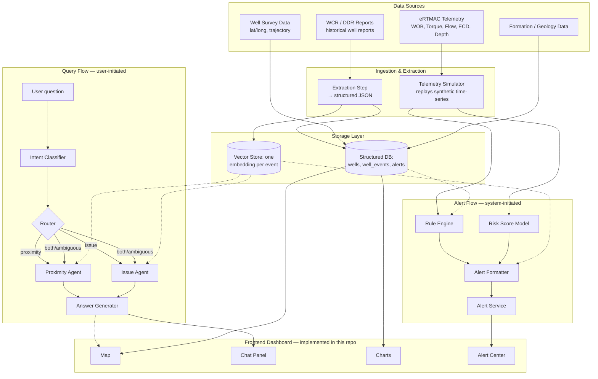

# eRTMAC-NWIS — Nearby Wells Intelligence System

**Smart India Hackathon 2026 · Drilling-safety intelligence layered on Oil India's eRTMAC real-time monitoring system**

> This README is written to give a reader with no prior context — including someone evaluating this as a proof of concept — a complete and honest picture of what NWIS is designed to do, and exactly what in this repository is real versus simulated for demonstration purposes.

## Table of Contents

- [Overview](#overview)
- [The Problem We're Solving](#the-problem-were-solving)
- [What NWIS Does (Full Vision)](#what-nwis-does-full-vision)
- [Current Status (What's In This Repo)](#current-status-whats-in-this-repo)
- [Screenshots](#screenshots)
- [System Architecture (Target Design)](#system-architecture-target-design)
- [Two Specialized RAG Agents](#two-specialized-rag-agents)
- [Real-Time Alerting Design](#real-time-alerting-design)
- [Tech Stack](#tech-stack)
- [Repository Structure](#repository-structure)
- [Getting Started](#getting-started)
- [Data Model Preview](#data-model-preview)
- [Roadmap](#roadmap)
- [Team](#team)
- [Acknowledgments](#acknowledgments)

---

## Overview

Oil India Limited (OIL) drills wells largely blind to its own history. Decades of Well Completion Reports, Daily Drilling Reports, and incident logs sit scattered across PDFs and file shares — full of hard-won lessons about stuck pipe, lost circulation, kicks, and cementing failures that almost never reach the engineer currently drilling nearby. eRTMAC, OIL's existing real-time drilling monitor, tells you what's happening *right now*. It has no memory of what happened *before*.

**eRTMAC-NWIS (Nearby Wells Intelligence System)** is a companion system designed to close that gap: it turns scattered historical reports into a queryable knowledge base, lets engineers ask plain-English questions and get sourced answers, and watches live drilling data to push proactive warnings before an incident happens — instead of after.

## The Problem We're Solving

When something goes wrong on a rig — a stuck pipe, a sudden loss of circulation — there is a good chance the exact same thing happened in a nearby well, or in the same rock formation elsewhere in the country, at some point in the past. That knowledge exists. It is simply never in front of the person who needs it, at the moment they need it. Engineers currently rely on manually recalling or searching through old reports, if they check at all. NWIS is built to make that historical knowledge automatically available, geographically and contextually relevant, in real time.

## What NWIS Does (Full Vision)

1. **Consolidates historical knowledge.** Well reports, daily drilling logs, and incident records are extracted into a structured, searchable knowledge base.
2. **Answers questions through two specialized retrieval agents.** One agent is scoped to wells *physically near* the current drilling location; the other searches for the *same type of problem* anywhere in India, regardless of distance. Together they cover both "what's happened around here?" and "how has this exact issue been solved before, wherever it happened?"
3. **Proactively pushes real-time alerts.** Live (or, for this POC, simulated) drilling telemetry is compared against known risk conditions from the knowledge base, and the system warns the engineer *before* an incident — without anyone needing to ask.
4. **Presents everything on one dashboard** — a map, a natural-language chat interface, historical KPI charts, and a live alert center.

## Current Status (What's In This Repo)

**This repository currently contains a fully designed frontend prototype of the dashboard experience.** Every visual element — the live telemetry monitor, the risk gauge, the critical alert banner, the offset well network with its schematic map, the case file panel, the alert log, and the natural-language search bar — is built, animated, and interactive. It was built first, deliberately, so the team could agree on the exact interaction model and user experience before investing backend effort.

**What is *not* yet real:** the intelligence behind the interface. The current prototype uses a scripted, deterministic demo sequence — the "telemetry" is a mathematically generated curve, the historical incident match is a single hardcoded example, and the search bar performs simple client-side keyword matching over a small local dataset — to demonstrate exactly how the finished experience is meant to look and feel. None of it yet reads from a real knowledge base, real embeddings, or a real LLM.

The table below is the honest map from what exists today to what the full system is designed to be:

| Capability | Current State (this repo) | Target Design |
|---|---|---|
| Dashboard UI/UX | ✅ Fully built and interactive | Same UI, wired to real data |
| Live telemetry | 🔶 Simulated — a deterministic animation curve stands in for a real feed | Real-time replay of synthetic (then real) eRTMAC sensor data via a backend service |
| Historical well data | 🔶 Simulated — 7 offset wells hardcoded in the frontend, illustrating the intended data shape | A structured knowledge base built from extracted well reports across India (see [Data Model Preview](#data-model-preview)) |
| Incident matching / alerts | 🔶 Simulated — one scripted "match" and a pre-written alert sequence | A real-time Rule Engine + Risk Model comparing live telemetry against the knowledge base |
| Natural-language search | 🔶 Simulated — client-side keyword matching over the local dataset | Two specialized RAG agents (see below), backed by an LLM |
| Map | 🔶 Simulated — a schematic radar view showing relative position | A real geographic map (Leaflet/Mapbox) spanning actual well coordinates across India |
| Backend / API / database | ⬜ Not yet built | FastAPI + SQLite + vector store — full technical specification in `/docs/technical-spec.md` |

**Legend:** ✅ Implemented and real · 🔶 Simulated for demonstration, real version designed but not built · ⬜ Not started

## Screenshots

*Screenshots to be added below — see suggested shots and filenames.*

| Dashboard — Normal Drilling | Critical Alert State | Historical Case File |
|---|---|---|
|  |  |  |
| The full dashboard during normal, within-envelope drilling conditions | The critical stuck-pipe risk banner triggering, with the risk gauge and alert log updating live | The matched historical incident, its cause, its remedy, and the recommended actions it generates |

*(Save screenshots into `docs/screenshots/` using the filenames above, or update the paths here — GitHub will render them inline automatically once added.)*

## System Architecture (Target Design)

The diagram below shows the complete system as designed — both the on-demand query path (a user asks a question) and the real-time alert path (the system warns without being asked). The frontend in this repo currently implements only the boxes in the **Frontend Dashboard** subgraph; every other box is designed but not yet built.



For the exact schemas, prompt templates, retrieval algorithms, and API contracts behind each box, see the full technical specification at `/docs/technical-spec.md`.

## Two Specialized RAG Agents

The core intellectual contribution of NWIS is splitting retrieval into two agents that answer genuinely different questions from the same underlying data:

- **Proximity Agent** — scoped to wells within a fixed radius of the current drilling location. Answers questions like *"what's happened near this site before?"*
- **Issue Agent** — scoped by problem type (stuck pipe, lost circulation, kick, cementing failure) with no location filter at all, searching every well in the dataset. Answers questions like *"how has lost circulation been fixed elsewhere in India, even far from here?"*

An intent classifier reads the user's question and routes it to one or both agents; when a question is ambiguous, both run and their results are merged. Both agents retrieve from the same vector store — they differ only in which filter is applied before retrieval, which keeps the system simple to build and reason about.

## Real-Time Alerting Design

Where the query flow waits for a question, the alert flow watches continuously and speaks up unprompted:

- A **Rule Engine** compares the current drilling depth against depths where offset wells previously had incidents — a direct, explainable trigger.
- A **Risk Model** watches live telemetry trends (torque, weight-on-bit, equivalent circulating density) for the kind of drift that historically preceded an incident, and produces a risk percentage.
- Either trigger produces an **Alert**, enriched with the specific historical precedent it's based on and a recommended action, and pushed straight to the dashboard's Alert Center.

## Tech Stack

| Layer | Current (this repo) | Planned |
|---|---|---|
| Frontend framework | React 19 (Create React App via CRACO) | — (unchanged) |
| Styling | Tailwind CSS, custom design tokens | — (unchanged) |
| Animation | Framer Motion | — (unchanged) |
| Icons | lucide-react | — (unchanged) |
| Backend | *none yet* | FastAPI (Python) |
| Database | *none yet* | SQLite |
| Vector store | *none yet* | Chroma (embedded) |
| Embeddings | *none yet* | sentence-transformers (`all-MiniLM-L6-v2`) |
| LLM (classification, answers) | *none yet* | Claude |
| Map | Schematic SVG (illustrative only) | Leaflet |
| Deployment | Vercel-ready (`vercel.json` included) | Same, plus a hosted backend |

## Repository Structure

**Current structure (this repo, as it stands today):**

```
POC_frontend/
  public/
    index.html
  src/
    components/nwis/
      AlertLog.jsx
      CaseFilePanel.jsx
      CriticalBanner.jsx
      Header.jsx
      LiveMonitor.jsx
      NearbyWells.jsx
      OffsetMap.jsx
      RiskGauge.jsx
      SearchBar.jsx
      ui.jsx
    data/
      scenario.js       # scripted demo telemetry + alert timeline
      wells.js           # hardcoded offset well dataset
    hooks/
      useAnimatedNumber.js
      useDemoEngine.js
    lib/
      format.js
      search.js           # client-side keyword search (to be replaced)
      utils.js
    pages/
      Dashboard.jsx
    App.css / App.js / index.css / index.js
  package.json, craco.config.js, tailwind.config.js, postcss.config.js, vercel.json
```

**Planned full structure (target, not yet present):**

```
nwis/
├── backend/
│   ├── main.py                    # FastAPI app + routes
│   ├── models.py                  # schemas
│   ├── db.py                      # SQLite setup
│   ├── vector_store.py            # embeddings + search
│   ├── agents/                    # intent classifier, both RAG agents, answer generator
│   ├── alerting/                  # simulator, rule engine, risk model
│   └── data/                      # wells.json, well_events.json, telemetry_sim.json
├── POC_frontend/                  # this repo's existing frontend
└── docs/
    └── technical-spec.md          # full build specification
```

## Getting Started

**Prerequisites:** Node.js 18+, Yarn (recommended — see `packageManager` in `package.json`).

```bash
cd POC_frontend
yarn install
yarn start
```

The app runs at `http://localhost:3000`. Use the **Pause / Skip to anomaly / Replay demo** controls in the header to control the scripted scenario during a walkthrough.

## Data Model Preview

The full system is designed around a small number of precise schemas — see `/docs/technical-spec.md` for the complete set (wells, telemetry, alerts). Here is the core one, a single historical incident record, which every retrieval agent, chart, and alert ultimately reads from:

```json
{
  "event_id": "EVT_0042",
  "well_id": "WELL_014",
  "formation": "Barail Sandstone",
  "depth_ft": 3120,
  "event_type": "lost_circulation",
  "cause": "low mud weight relative to formation pressure",
  "remedy": "added LCM, reduced flow rate",
  "npt_hours": 6.5,
  "raw_text_excerpt": "At 3120 ft in the Barail Sandstone, mud losses of 40 bbl/hr were observed. Mud weight was increased and LCM pills were pumped, resolving losses within 6.5 hours."
}
```

## Roadmap

- [x] Design full system architecture (query flow + alert flow)
- [x] Build interactive frontend prototype demonstrating the intended UX
- [x] Write complete technical specification (schemas, algorithms, API contracts)
- [x] Build synthetic dataset (wells, historical events, simulated telemetry)
- [ ] Stand up backend (FastAPI + SQLite + vector store)
- [ ] Implement Intent Classifier, Proximity Agent, Issue Agent, Answer Generator
- [ ] Implement Rule Engine and Risk Model against live telemetry
- [ ] Replace frontend's simulated data and search with real API calls
- [ ] Replace schematic map with a real geographic map
- [ ] Add historical KPI charts (NPT by cause, ROP vs. depth)

## Team

| Name | Role |
|---|---|
| Shrey | Team Lead |
| — | — |
| — | — |
| — | — |
| — | — |
| — | — |

## Acknowledgments

Built for **Smart India Hackathon 2026**, in response to a problem statement centered on Oil India Limited's eRTMAC real-time drilling monitoring system. NWIS is designed as a complementary institutional-memory layer for eRTMAC, not a replacement for it.
