# NWIS — Nearby Wells Intelligence System

> Frontend available: sih-2026-pi-swart.vercel.app 

> **AI-powered institutional memory and predictive decision support for drilling operations**

NWIS is designed to work alongside OIL's existing **eRTMAC** monitoring environment. It converts scattered historical drilling knowledge into structured intelligence, correlates it with the active well, continuously analyses live telemetry, predicts emerging risks, and provides evidence-backed recommendations before historical problems repeat.

---

## The problem

Drilling decisions depend on more than the current well's telemetry. Engineers also need to know what happened in nearby and historically comparable wells:

- Where did mud losses start?
- Which formations repeatedly caused stuck pipe?
- What telemetry patterns preceded kicks or overpressure?
- Which mud, casing, cementing and operational responses worked?
- How much NPT did an incident create?
- Is the current well approaching a known high-risk depth or formation?

This knowledge is distributed across WCRs, DDRs, mud logging records, geological reports, drilling databases, well surveys and individual experience. NWIS turns that fragmented history into a continuously available **institutional memory**.

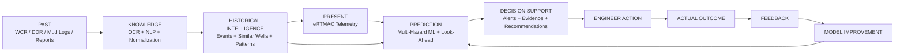

## Solution at a glance

| Capability | What NWIS does |
|---|---|
| **Document Intelligence** | OCR, parse and extract drilling facts/events from WCRs, DDRs and other reports |
| **Institutional Memory** | Stores incidents, causes, mitigations, outcomes, lessons and source provenance |
| **Well Intelligence** | Finds nearby, geologically similar, trajectory-similar and operationally similar wells |
| **Hybrid AI Search** | Combines structured filtering with semantic retrieval and evidence ranking |
| **Live Intelligence** | Continuously processes current drilling telemetry |
| **Predictive ML** | Predicts stuck pipe, losses, kicks, tight hole, overpressure and other hazards |
| **Look-Ahead** | Predicts what may happen in the next depth/time window, not only what is happening now |
| **Explainable Alerts** | Shows why risk increased, what historical wells support it and model confidence |
| **Decision Support** | Provides contextual recommendations backed by historical evidence |
| **Feedback Loop** | Captures acknowledgement, action and actual outcome for model improvement |

## Jellyfish view — the five intelligence “tentacles”

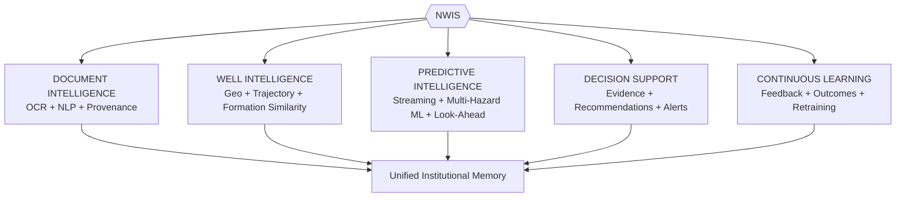

Each “tentacle” solves one part of the problem; together they create a single past-to-present-to-future drilling intelligence loop.

---

# 1. End-to-end NWIS architecture

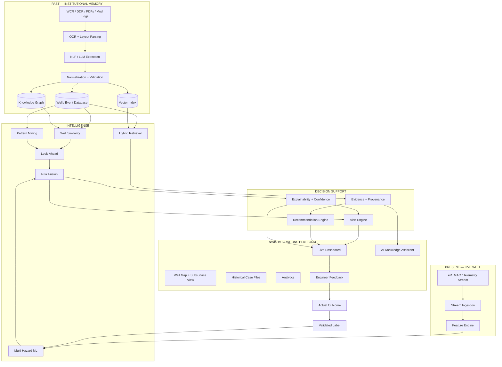

### The core loop

```text
PAST
Historical wells
   ↓
KNOWLEDGE
What happened + why + mitigation + outcome
   ↓
PRESENT
Current well + live telemetry
   ↓
PREDICTION
What is likely to happen next?
   ↓
ACTION
What did comparable wells do successfully?
   ↓
FEEDBACK
What actually happened?
   ↓
LEARNING
Improve future predictions
```

---

# 2. Historical document intelligence

The current frontend is a UX proof-of-concept; the final backend will replace demo data with a real document-to-knowledge pipeline.

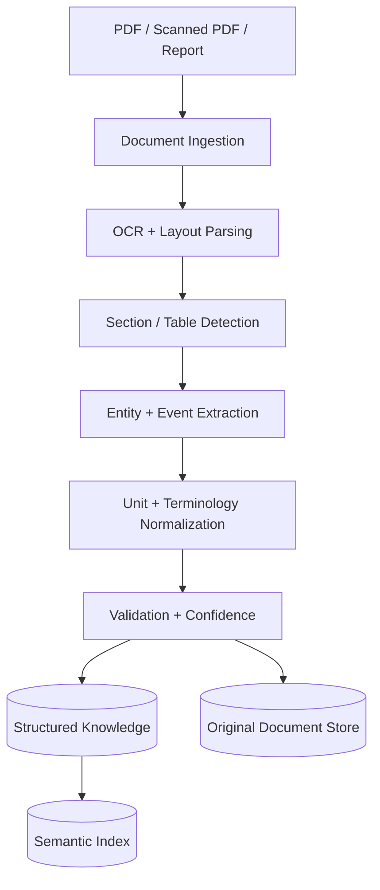

### Extracted information

- Well identity and metadata
- Formation names and intervals
- Depth / MD / TVD
- Drilling parameters
- Mud properties and ECD context
- Reservoir / geological properties available in source data
- Casing and cementing operations
- BHA / bit information
- Stuck pipe, losses, kicks, tight hole and other events
- Causes and contributing conditions
- Mitigation actions
- Outcomes and NPT
- Lessons learned
- Source document, page and section

Every extracted fact retains provenance where available:

```json
{
  "event": "lost_circulation",
  "formation": "Barail Sandstone",
  "depth_start_ft": 3110,
  "depth_end_ft": 3140,
  "loss_rate_bbl_hr": 40,
  "remedy": "LCM pill",
  "source": {
    "document": "WCR_WELL_014.pdf",
    "page": 47,
    "section": "Mud Losses"
  }
}
```

This makes the AI answer **auditable rather than purely generative**.

---

# 3. Canonical drilling knowledge model

Instead of treating every incident as an isolated text chunk, NWIS models the relationships between the well, geology, operations, incidents and outcomes.

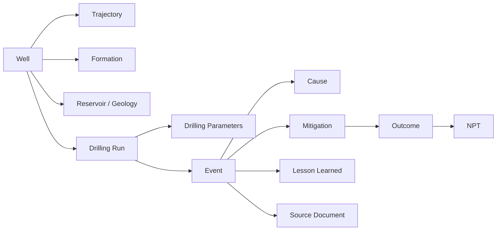

### Core entities

| Entity | Purpose |
|---|---|
| **Well** | Identity, location, field, basin, dates, status, TD |
| **Trajectory** | Survey points, inclination, azimuth, TVD/MD, dogleg |
| **FormationInterval** | Formation top/base and geological context |
| **Reservoir** | Pressure, permeability, depletion and available reservoir properties |
| **DrillingRun** | BHA, bit, RPM, WOB, ROP and interval |
| **MudProgram** | Mud weight, rheology, additives, ECD context |
| **CasingProgram** | Hole/casing sizes and depths |
| **CementingOperation** | Placement parameters and outcome |
| **DrillingEvent** | Hazard, depth, cause, severity and outcome |
| **NPTEvent** | Time lost and cause |
| **Mitigation** | Response taken and effectiveness |
| **Source** | Original report/page/section + extraction confidence |

---

# 4. Nearby wells + similar wells

A key design principle is:

> **Nearby does not necessarily mean similar.**

NWIS will rank comparison wells using multiple dimensions:

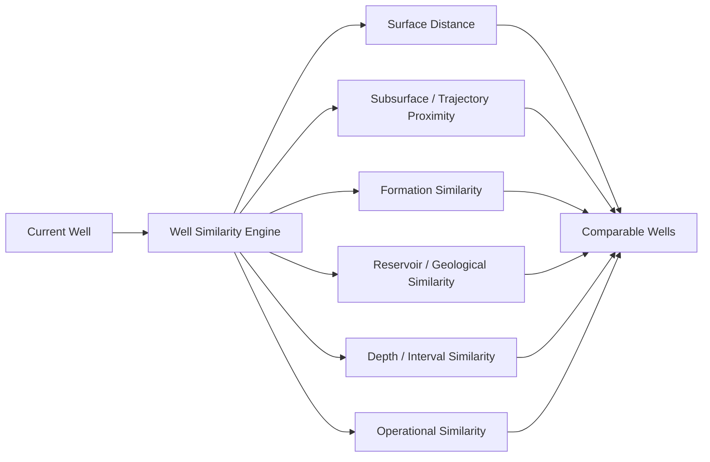

### Similarity outputs

- Nearby wells within a configurable radius
- Top similar wells beyond the radius
- Formation-matched wells
- Similar trajectory / subsurface wells
- Similar pressure or operational context
- Historical hazard analogues

The UI will expose **why** a well is similar instead of showing an unexplained similarity percentage.

---

# 5. Interactive map + subsurface correlation

The map will support:

- User-defined radius
- Well selection
- Formation filters
- Event-type filters
- Severity filters
- NPT filters
- Field / basin filters
- Historical vs active wells

The existing schematic offset map becomes a real geospatial view in the final system, while a second view will show **subsurface correlation** using well trajectories and formation/depth alignment.

```text
SURFACE VIEW

             ● NHR-28
                  |
      ● DUL-17 — ◆ CURRENT — ● BOG-12
                  |
             ● KDM-05

SUBSURFACE VIEW

3400 m     Current       NHR-28       TSK-11
              |             |            |
3410 m        |             ● STUCK      |
              |                          |
3425 m        |                          ● PRE-STICK
              |
3440 m        |             ● STUCK      |

Formation: BARAIL ARENACEOUS
```

---

# 6. AI institutional-memory assistant

NWIS will provide natural-language access to the knowledge base.

Example query:

> **“What problems occurred in comparable Barail wells around 3,400 m, and what worked?”**

Expected response structure:

```text
3 comparable wells experienced problems in this interval.

NHR-28 — differential sticking at ~3410 m
TSK-11 — pre-sticking signature at ~3425 m
DUL-17 — severe sticking at ~3440 m

Common indicators:
• torque increase
• WOB variability
• ECD increase

Historical response:
pipe-freeing treatment + reduced overbalance + wiper-trip preparation

Sources:
NHR-28 WCR p.47
TSK-11 DDR p.19
DUL-17 DDR p.83
```

### Retrieval pipeline

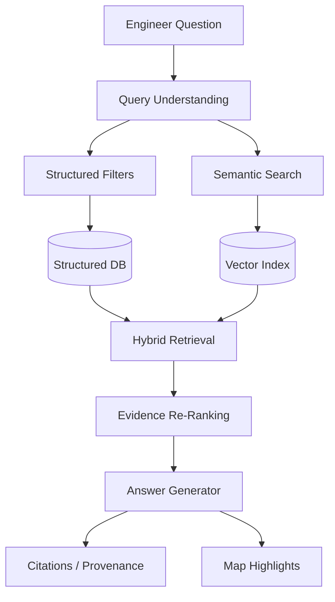

The assistant will support questions about proximity, formations, hazards, causes, remedies, NPT, similar wells and historical patterns.

---

# 7. Real-time drilling intelligence

The current frontend uses a deterministic telemetry scenario to demonstrate the target experience. The final system will replace the demo engine with a streaming connector while preserving the same dashboard workflow.

### Input signals

Depending on eRTMAC availability:

- Depth
- WOB
- Torque
- ROP
- RPM
- Flow in/out
- ECD
- Pressure
- Hookload / drag
- Mud properties
- Gas indicators
- Other available drilling parameters

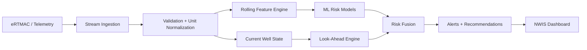

---

# 8. Time-series feature engineering

NWIS will evaluate trends, not only individual readings.

Features include:

- Moving average / variance
- Torque slope and deviation
- WOB slope and variability
- ECD deviation
- ROP deterioration
- Pressure derivative
- Flow imbalance
- Stick-slip indicators
- Drag / overpull changes
- Formation transition indicators
- Distance to historical hazard zones
- Historical event frequency ahead of the bit
- Similar-well behaviour at the same interval

```text
Raw stream
   ↓
Rolling windows
   ↓
Trend + variability
   ↓
Current operational context
   ↓
Geological context
   ↓
Historical context
   ↓
ML feature vector
```

---

# 9. Multi-hazard predictive ML

The final system will move beyond the single stuck-pipe demonstration and predict multiple drilling hazards.

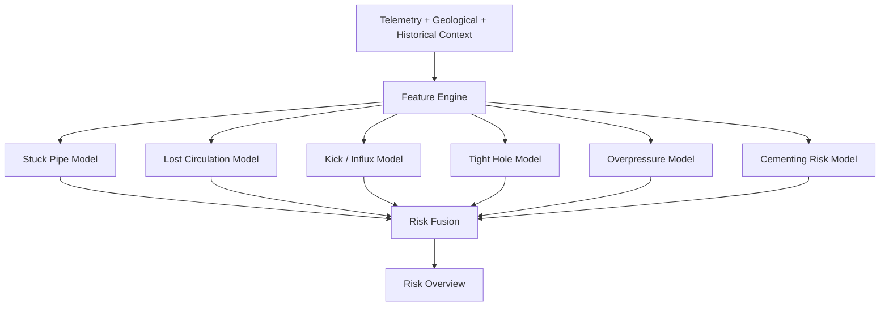

Example UI:

```text
RISK ENGINE

Stuck Pipe          84%  HIGH
Lost Circulation    67%  MEDIUM
Tight Hole          54%  MEDIUM
Overpressure        31%  LOW
Kick                18%  LOW
```

### Model strategy

We will benchmark interpretable baselines and stronger models using the available data:

- Logistic Regression baseline
- Random Forest baseline
- XGBoost / LightGBM for structured risk prediction
- Temporal models such as LSTM/GRU/TCN only where the historical dataset justifies them

The selection criterion is **validation performance + operational usefulness + explainability**, not simply model complexity.

---

# 10. Early-warning labels and evaluation

The predictive dataset will be built around **future outcomes**, not only current incident recognition.

```text
Features at depth t
      ↓
Prediction horizon: next Δ depth / Δ time
      ↓
Did the hazard occur?
      ↓
YES / NO label
```

Example:

```text
Features at 3,050 m
        ↓
Next 100 m
        ↓
Historical loss occurred at 3,120 m
        ↓
label = 1
```

### Evaluation

**ML metrics:** Precision, Recall, F1, ROC-AUC, PR-AUC.

**Operational metrics:**

- Average warning lead time
- Incidents detected before occurrence
- False alerts per 1,000 ft/m drilled
- Missed critical incidents
- Precision of top-risk intervals
- Performance by formation / field / well

No performance figure will be claimed until it is measured on a documented validation set.

---

# 11. Look-ahead prediction

The system will maintain a risk window ahead of the active depth.

```text
CURRENT DEPTH: 3,095 m

3,095 ─────────────────────────────────── 3,295 m
         │            │            │
       normal       warning     historical
                                  hazard zone
            ↑
         current bit
```

The look-ahead engine combines:

- Current telemetry trend
- Formation transitions
- Historical event depths
- Similar-well behaviour
- Geological / trajectory similarity
- ML probabilities
- Historical warning lead times

The key product question becomes:

> **“What risk is likely in the next 50 / 100 / 200 m, and what evidence supports that prediction?”**

---

# 12. Pattern mining: “what happened next?”

NWIS will capture temporal sequences around incidents.

```text
Torque ↑
   ↓
ROP ↓
   ↓
Drag ↑
   ↓
ECD ↑
   ↓
STUCK PIPE
   ↓
Fishing / NPT
```

Instead of simply retrieving “stuck pipe at 3,120 m”, the system can learn that a particular sequence repeatedly appeared before it.

The same approach applies to losses, kicks and other hazards.

---

# 13. Risk explanation + confidence

Every prediction should explain itself.

```text
STUCK PIPE RISK — 84%
Confidence — HIGH

Current telemetry
+23% torque deviation
+16% WOB variability
+8% ECD deviation

Historical evidence
3 highly comparable wells
2 documented stuck-pipe events

Formation similarity     92%
Trajectory similarity    88%
Sensor completeness      96%
```

Risk and confidence remain separate because a high-risk prediction can still be low-confidence when relevant historical data is sparse or telemetry is incomplete.

---

# 14. Historical pattern / knowledge graph

NWIS will represent relationships between operational concepts so it can reason across documents and wells.

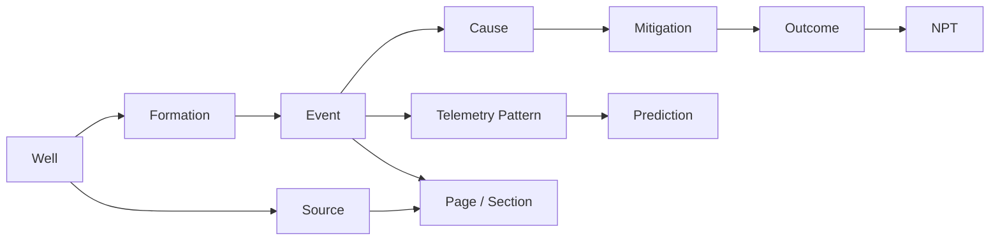

This enables questions such as:

- Which formations repeatedly produce the same hazard?
- Which causes recur across wells?
- Which mitigations are associated with successful outcomes?
- What telemetry pattern precedes the hazard?
- What happened next in comparable wells?

---

# 15. Evidence-backed recommendations

NWIS recommendations will be contextual, not generic.

```text
Current observation
        +
ML prediction
        +
Historical analogue
        +
Comparable-well evidence
        +
Known mitigation outcome
        ↓
Suggested action for engineer review
```

Example:

```text
LOST CIRCULATION RISK: 82%

Current signal:
ECD rising above recent baseline.

Historical evidence:
4 of 6 comparable wells had losses in this interval.

Historical response:
LCM treatment was successful in comparable cases.

Suggested preparation:
Review the mud program and prepare appropriate loss-control material
before entering the predicted interval.
```

NWIS remains a **decision-support layer**; operational decisions remain with the drilling team.

---

# 16. Historical case files

The current frontend already has a historical case-file concept. The final version will turn it into a complete evidence packet.

A case file will contain:

- Well identity and location
- Surface and subsurface distance
- Similarity breakdown
- Formation and depth
- Event / hazard
- Pre-event telemetry signature
- What happened next
- Cause
- NPT
- Mitigation
- Outcome
- Similar wells
- Source document/page/section

### Current vs historical signature

```text
                 HISTORICAL       CURRENT
Depth             3,410 m         3,412 m
Torque            +80%            +74%
ECD               11.2 ppg        11.1 ppg
WOB               erratic         erratic
Outcome           STUCK PIPE      PREDICTED RISK
```

---

# 17. Historical analytics

In addition to case files, the dashboard will provide cross-well analytics:

- NPT by hazard
- NPT by formation
- Event frequency by field
- Event frequency by formation
- Loss severity distribution
- Stuck-pipe depth distribution
- Average remediation time
- Successful vs unsuccessful mitigation
- Historical warning lead time
- False-alert rate
- Model recall / precision by hazard

This turns the system into both an operational tool and an institutional analytics platform.

---

# 18. Current-vs-offset comparison

The engineer will be able to compare the active well with its most relevant analogues:

```text
                CURRENT    NHR-28    TSK-11    DUL-17
Formation       Barail     Barail    Barail    Barail
Depth           3412 m     3410 m    3425 m    3440 m
Torque          19.8       21.6      20.9      22.1
ECD             11.0       11.2      11.0      11.3
WOB             31         34        28        32
Outcome         —          STUCK     AVERTED   STUCK
NPT             —          48.5 h    6 h       72 h
```

This gives engineers immediate context without opening multiple reports manually.

---

# 19. Intelligent alerting

Alerts combine multiple evidence sources instead of firing only from a fixed depth threshold.

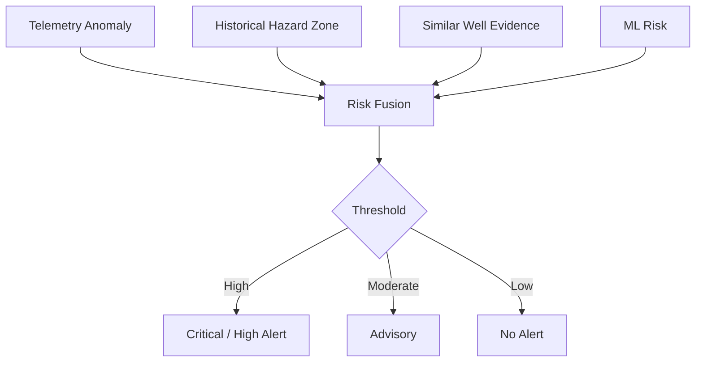

Every alert answers:

1. **What is the risk?**
2. **Why did it trigger?**
3. **Which historical evidence supports it?**
4. **What should the engineer review or prepare?**

---

# 20. Alert lifecycle + feedback loop

Alerts are first-class operational records:

```text
NEW
 ↓
ACKNOWLEDGED
 ↓
UNDER REVIEW
 ↓
ACTION TAKEN
 ↓
RESOLVED / DISMISSED
 ↓
OUTCOME RECORDED
```

For every alert we can store:

- Predicted hazard
- Risk score
- Confidence
- Supporting historical wells
- Alert depth/time
- Engineer acknowledgement
- Engineer action
- Actual outcome
- Prediction correctness

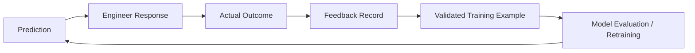

This is the foundation for **continuous institutional learning**.

---

# 21. Data quality + normalization

Historical industrial data is messy. NWIS will explicitly handle:

- Missing telemetry
- Duplicate records
- OCR errors
- Inconsistent units
- Inconsistent formation names
- Different well naming conventions
- Contradictory depths
- Incomplete reports

Example canonicalization:

```text
Barail Sandstone
Barail SS
BARAIL
Barail Formation
      ↓
BARAIL_SANDSTONE
```

Data-quality warnings will be surfaced rather than silently hidden.

---

# 22. Provenance and auditability

The system will distinguish:

```text
OBSERVED
What the system measured

HISTORICAL
What comparable wells experienced

PREDICTED
What the model estimates

RECOMMENDED
What the system suggests reviewing

DECISION
What the engineer chooses to do
```

Example evidence panel:

```text
Claim:
“Lost circulation occurred in this interval in 4 comparable wells.”

Evidence:
NHR-28 · WCR · p.47
DIK-03 · DDR · p.31
TSK-11 · DDR · p.19
BOG-12 · DDR · p.12
```

---

# 23. Frontend — final product

The existing frontend already establishes the main operations workflow:

- Active well header
- Live drilling monitor
- Risk gauge
- Historical case file
- Offset well network
- Schematic well map
- Natural-language search surface
- Critical alert banner
- Alert log
- Demo/replay controls

The final frontend will evolve this into:

```text
NWIS Operations Dashboard
├── Active Well / Operations Header
├── Live Telemetry
├── Multi-Hazard Risk Overview
├── Risk Explanation + Confidence
├── Look-Ahead Risk Timeline
├── Interactive Well Map
├── Subsurface Correlation
├── Nearby + Similar Wells
├── Current vs Offset Comparison
├── Historical Analytics
├── Historical Case File
├── AI Knowledge Assistant
├── Alert Center
└── Engineer Feedback / Outcome Capture
```

### Additional page: Knowledge Administration

A separate page will manage the institutional-memory pipeline without cluttering the live drilling cockpit:

```text
Documents
  ↓
OCR / Parsing Status
  ↓
Extracted Entities + Events
  ↓
Validation / Confidence
  ↓
Sources + Relationships
  ↓
Indexed Knowledge
```

---

# 24. Target backend architecture

```text
backend/
├── api/
├── models/
├── db/
├── ingestion/
│   ├── ocr/
│   ├── parsers/
│   ├── extraction/
│   └── normalization/
├── knowledge/
│   ├── retrieval/
│   ├── embeddings/
│   ├── similarity/
│   └── graph/
├── streaming/
│   ├── connectors/
│   ├── features/
│   └── state/
├── ml/
│   ├── datasets/
│   ├── training/
│   ├── inference/
│   ├── explainability/
│   └── evaluation/
├── risk/
│   ├── fusion/
│   ├── lookahead/
│   └── alerts/
└── recommendations/
```

### Suggested stack

| Layer | Technology | Purpose |
|---|---|---|
| Frontend | React | Operations dashboard |
| Backend | Python + FastAPI | APIs and orchestration |
| Relational DB | PostgreSQL / SQLite for development | Structured well/event data |
| Spatial | PostGIS / spatial calculations | Well + trajectory analysis |
| Vector search | pgvector / Chroma | Semantic retrieval |
| OCR | Tesseract or deployment-appropriate OCR | Scanned reports |
| NLP / LLM | Domain extraction + grounded generation | Document intelligence / assistant |
| ML | scikit-learn + XGBoost/LightGBM; temporal models where justified | Hazard prediction |
| Streaming | WebSocket / MQTT / Kafka-compatible design | Telemetry |
| Visualization | Recharts / SVG / map library | Operations and analytics |

---

# 25. API surface

Representative API contract:

```text
GET  /api/wells
GET  /api/wells/{well_id}
GET  /api/wells/{well_id}/trajectory
GET  /api/wells/{well_id}/events
GET  /api/wells/{well_id}/similar
GET  /api/wells/nearby?lat=&lon=&radius=

POST /api/query
POST /api/query/similar-wells
POST /api/query/historical-patterns

GET  /api/telemetry/current
GET  /api/telemetry/history
WS   /ws/telemetry

GET  /api/risk/current
GET  /api/risk/lookahead
GET  /api/risk/explanations

GET  /api/alerts
POST /api/alerts/{id}/acknowledge
POST /api/alerts/{id}/resolve
POST /api/alerts/{id}/feedback

GET  /api/analytics/npt
GET  /api/analytics/events
GET  /api/analytics/formations
GET  /api/analytics/model-performance

POST /api/documents/upload
GET  /api/documents/{id}
GET  /api/documents/{id}/extraction
POST /api/documents/{id}/validate
```

The frontend will become fully API-driven rather than depending on hardcoded demo state.

---

# 26. Security, governance and safety

For a production deployment the architecture supports:

- Authentication
- Role-based access control
- API authentication
- Encryption in transit and at rest
- Document access controls
- Audit logging
- Model/version tracking
- Alert history
- Engineer approval trail
- Data-quality monitoring

NWIS is **not an autonomous drilling controller**. It is a decision-support system that keeps the human engineer in the loop.

---

# 27. Continuous learning / MLOps

As more real wells are completed:

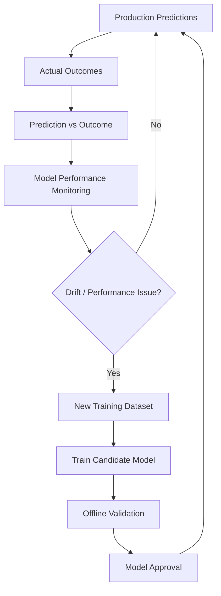

This enables the system to learn from new wells instead of remaining a static model.

---

# 28. Demo story

The final demonstration should feel like one continuous operational event.

### 1. Start with the current well

Show active well, depth, formation, live telemetry and nearby/similar wells.

### 2. Ask the institutional memory

> “What happened in comparable wells around this formation and depth?”

The assistant retrieves evidence and highlights the relevant wells.

### 3. Show the historical case file

Open an analogue and inspect the event, pre-event signature, cause, mitigation, NPT and source evidence.

### 4. Start live monitoring

Telemetry updates continuously.

### 5. Risk begins to rise

The multi-hazard engine detects changing trends and updates the risk overview.

### 6. Look-ahead identifies the hazard

The system highlights a future interval with historical evidence and predicted risk.

### 7. Alert fires

The alert includes hazard, risk, confidence, historical analogue, depth/formation and recommended preparation.

### 8. Engineer reviews evidence

Current vs offset comparison and the case file explain why the system raised the alert.

### 9. Action is recorded

The engineer acknowledges the alert and records the response.

### 10. Outcome closes the loop

The actual outcome is captured for evaluation and future model improvement.

---

# 29. Current POC → Final NWIS

The current repository is intentionally a frontend proof-of-concept. Its existing scripted telemetry, static well archive and scripted alerts demonstrate the intended workflow; they will be replaced by real services without throwing away the UI.

| Current POC | Final NWIS |
|---|---|
| Scripted telemetry | eRTMAC/streaming connector |
| Static well data | Structured DB + spatial layer |
| Keyword search | Hybrid semantic + structured retrieval |
| Fixed analogue | Similarity engine |
| Single risk gauge | Multi-hazard predictive risk |
| Scripted anomaly | Feature-based live detection |
| Hardcoded case file | Retrieved evidence + provenance |
| Static actions | Context-aware recommendations |
| Scripted alerts | Risk-fused alert engine |
| Synthetic incidents | OCR/NLP-extracted events |
| Demo relationships | Knowledge graph / relationship layer |
| Replay controls | Live + historical replay |
| No feedback | Alert outcome + engineer feedback |

---

# 30. Why NWIS is more than a chatbot

NWIS combines several intelligence layers that solve different parts of the drilling problem:

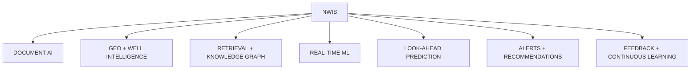

The value comes from connecting them:

```text
Historical reports
      ↓
Structured institutional memory
      ↓
Comparable wells + historical patterns
      ↓
Current telemetry
      ↓
Predictive risk
      ↓
Evidence-backed recommendation
      ↓
Engineer action
      ↓
Actual outcome
      ↓
Better future predictions
```

---

# 31. Development roadmap

### Phase 1 — Foundation

- Final schema and domain ontology
- Representative synthetic + available test data
- Backend API
- Frontend/API integration

### Phase 2 — Institutional memory

- OCR and document parsing
- NLP/event extraction
- Normalization
- Provenance
- Vector search
- Knowledge graph / relationships

### Phase 3 — Well intelligence

- Geospatial search
- Trajectory analysis
- Formation matching
- Well similarity
- Cross-well pattern mining

### Phase 4 — Predictive intelligence

- Telemetry ingestion
- Feature engineering
- Hazard labels
- Baseline models
- Multi-hazard ML
- Look-ahead prediction
- Explainability + confidence

### Phase 5 — Decision support

- Risk fusion
- Alerts
- Historical evidence
- Recommendations
- Alert lifecycle
- Feedback capture

### Phase 6 — Validation and hardening

- Model evaluation
- False-alert analysis
- Integration tests
- Security hardening
- End-to-end demonstration dataset
- Deployment preparation

---

# 32. Final vision

```text
BEFORE NWIS

Reports → Search → Read → Remember → Decide

AFTER NWIS

Reports ────────┐
                │
eRTMAC ─────────┼──→ NWIS → Understand → Predict → Prepare
                │                    │
Well geometry ──┘                    └────────→ Learn
```

> **NWIS turns scattered drilling history into a continuously available institutional memory.**

It connects **documents, wells, formations, trajectories, telemetry, historical events, machine learning, recommendations and engineer outcomes** so that the experience of every completed well can help the next well **before the same problem happens again**.

---

## Status

**Current:** Frontend proof-of-concept / product UX demonstration  
**Target:** End-to-end AI/ML decision-support platform with document intelligence, geospatial and subsurface well intelligence, real-time multi-hazard prediction, explainable alerts, evidence-backed recommendations and continuous learning.

---

## License

Project-specific licensing and data-use terms will be added according to hackathon and OIL requirements.
