<div align="center">

# 🛢️ NWIS — Nearby Wells Intelligence System

### Institutional memory for drilling teams. It looks ahead of the bit and backs every alert with evidence.

*A standalone AI decision-support layer built to run alongside Oil India's **eRTMAC** real-time monitoring system.*

<br/>


<br/>

[**The Problem**](#-the-problem) · [**Our Solution**](#-our-solution) · [**Requirement Coverage**](#-how-nwis-covers-the-problem-statement) · [**Look-Ahead Engine**](#-the-signature-feature-formation-aware-look-ahead-hazard-horizon) · [**Architecture**](#%EF%B8%8F-system-architecture) · [**Quick Start**](#-quick-start) · [**Roadmap**](#%EF%B8%8F-roadmap)

<br/>

<picture>
  <source media="(prefers-color-scheme: dark)" srcset="SIH/SIH/artifacts/screenshots/nwis-live-dark.png">
  <source media="(prefers-color-scheme: light)" srcset="SIH/SIH/artifacts/screenshots/nwis-live-light.png">
  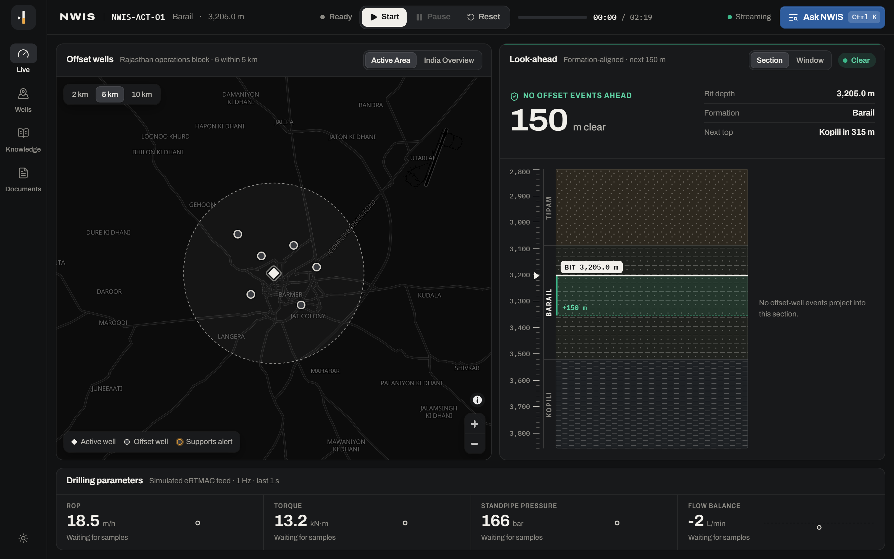
</picture>

<sub><i>Live workspace: the active well, its six offset wells, the Formation-Aware Look-Ahead Hazard Horizon and streaming eRTMAC telemetry, all on one screen.</i></sub>

</div>

---

## 🎯 The Problem

eRTMAC shows a drilling team **what the active well is doing right now**. It cannot show **what happened when the wells around it drilled through the same rock**.

That knowledge exists, but it is spread across hundreds of Well Completion Reports, Daily Drilling Reports, mud-logging databases, scanned PDFs and the memories of senior engineers. When the bit is approaching a formation known for trouble, nobody has time to search for it.

> **The cost:** slow decisions, mud losses and stuck pipe that could have been anticipated, and non-productive time (NPT) that repeats from well to well.

Engineers need a quick answer to six questions:

| # | Question |
|:-:|:--|
| 1 | Which nearby or analogous wells matter **right now**? |
| 2 | What happened when those wells crossed **this formation**? |
| 3 | Is a recurring hazard **ahead of the bit**? |
| 4 | Does live telemetry show **supporting warning signs**? |
| 5 | What **historical evidence** supports the alert? |
| 6 | How did the crew **respond** last time? |

---

## 💡 Our Solution

**NWIS** gives the drilling team an institutional memory. It reads historical drilling documents, turns them into structured, page-cited drilling events, and continuously compares the active well against its offset wells **by formation rather than by raw depth**.

As eRTMAC telemetry advances the bit, NWIS projects historical incidents onto the active well's trajectory and raises an alert **before** the bit reaches the dangerous interval. Each alert can be traced to the source page it came from.

<div align="center">

**📄 Historical report → 🧩 Structured event → 🗺️ Offset-well intelligence → 📡 Live drilling context → ⚠️ Proactive alert → 🔎 Exact evidence → 🤖 Grounded AI insight**

</div>

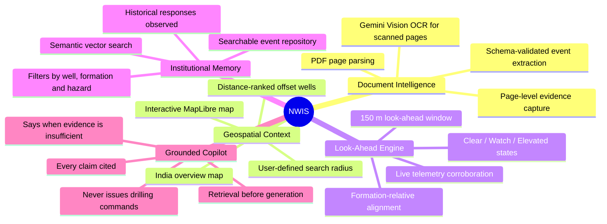
```mermaid
mindmap
  root((NWIS))
    Document Intelligence
      PDF page parsing
      Gemini Vision OCR for scanned pages
      Schema-validated event extraction
      Page-level evidence capture
    Geospatial Context
      Interactive MapLibre map
      User-defined search radius
      Distance-ranked offset wells
      India overview map
    Look-Ahead Engine
      Formation-relative alignment
      150 m look-ahead window
      Clear / Watch / Elevated states
      Live telemetry corroboration
    Institutional Memory
      Searchable event repository
      Filters by well, formation and hazard
      Historical responses observed
      Semantic vector search
    Grounded Copilot
      Retrieval before generation
      Every claim cited
      Says when evidence is insufficient
      Never issues drilling commands
```

### Three design principles

<table>
<tr>
<td width="33%" valign="top">

#### 🔎 Evidence first
Evidence is stored as its own record, linked to an exact document and page. **No alert can exist without stored evidence**, and every copilot claim carries a clickable citation.

</td>
<td width="33%" valign="top">

#### 🧭 Formation-aware
Raw depths cannot be compared across wells. NWIS aligns incidents by their **normalized position inside the same formation**, which is how a geologist reads offset wells.

</td>
<td width="33%" valign="top">

#### ⚖️ AI where it helps, deterministic where it matters
AI reads unstructured documents and summarises evidence. **Alert arithmetic, depth projection and scoring are deterministic and explainable**, and they are never delegated to an LLM.

</td>
</tr>
</table>

---

## ✅ How NWIS Covers the Problem Statement

| # | Expected outcome (from the problem statement) | How NWIS delivers it |
|:-:|:--|:--|
| **i** | Use AI, NLP and OCR to extract and structure information from historical reports | A six-stage ingestion pipeline: PyMuPDF text extraction, **Gemini Vision OCR** for low-text or scanned pages, **strict JSON-schema extraction** validated with Pydantic, evidence verification against the page text, and embedding and indexing |
| **ii** | Map-based visualization of nearby wells within a user-defined radius | **MapLibre GL** map with the active well, distance-ranked offsets, a selectable **2 / 5 / 10 km radius**, and an India overview drawn on the official Survey of India boundary |
| **iii** | Searchable knowledge repository of events, lessons learned and mitigations | The **Knowledge** workspace searches validated events by well, formation, hazard and free text, combining semantic and lexical retrieval. Each result shows the *historical response observed* and its source page |
| **iv** | Correlate geological, drilling and reservoir data across wells by depth and formation | **Formation-relative alignment** projects every offset-well incident onto the active well's formation column. In our demo, four mud-loss events recorded **210 m apart** in raw depth line up within **9 m** of each other once aligned |
| **v** | Predictive analytics for mud loss, stuck pipe, overpressure, torque spikes and cementing issues | The **look-ahead risk engine** combines analog relevance, recurrence across wells and hazard-specific telemetry signatures (flow imbalance, pit trend, gas, torque deviation, ROP collapse, SPP) to predict hazards **up to 150 m before the bit reaches them** |
| **vi** | Real-time alerts and recommendations | A WebSocket stream at 1 Hz drives **Clear → Watch → Elevated** alerts. *Why this alert?* opens the full score breakdown and the historical responses observed, each with its citation |
| **vii** | A user-friendly dashboard for field and office personnel | A dense, calm interface for operations rooms, with light and dark themes, a one-screen live view, and **Wells**, **Knowledge** and **Documents** workspaces. The **Ask NWIS** copilot takes plain-English questions |

---

## 🌟 The Signature Feature: Formation-Aware Look-Ahead Hazard Horizon

### Why raw depth fails

Formation tops shift from well to well. A mud loss at **3,294 m** in one well and another at **3,429 m** in a neighbouring well look unrelated if you compare depths, but both occurred about **two-thirds of the way down the Barail formation**. That is the same geological position.

### How NWIS aligns wells

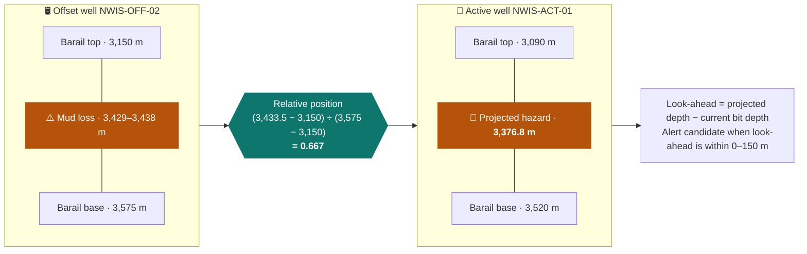
```mermaid
flowchart LR
    subgraph OFF["🛢️ Offset well NWIS-OFF-02"]
        direction TB
        O1["Barail top · 3,150 m"]
        O2["⚠️ Mud loss · 3,429–3,438 m"]
        O3["Barail base · 3,575 m"]
        O1 --- O2 --- O3
    end

    REL{{"Relative position<br/>(3,433.5 − 3,150) ÷ (3,575 − 3,150)<br/><b>= 0.667</b>"}}

    subgraph ACT["🎯 Active well NWIS-ACT-01"]
        direction TB
        A1["Barail top · 3,090 m"]
        A2["📍 Projected hazard · <b>3,376.8 m</b>"]
        A3["Barail base · 3,520 m"]
        A1 --- A2 --- A3
    end

    OFF --> REL --> ACT
    ACT --> LA["Look-ahead = projected depth − current bit depth<br/>Alert candidate when look-ahead is within 0–150 m"]

    style REL fill:#0f766e,color:#fff,stroke:#0f766e
    style A2 fill:#b45309,color:#fff,stroke:#b45309
    style O2 fill:#b45309,color:#fff,stroke:#b45309
```

### The result on our demo corpus

| Offset well | Recorded mud-loss depth | Barail interval in that well | Relative position | **Projected onto the active well** |
|:--|--:|:--:|:--:|--:|
| NWIS-OFF-03 | 3,227 m | 2,960 – 3,370 m | 0.661 | **3,374.2 m** |
| NWIS-OFF-01 | 3,294 m | 3,020 – 3,440 m | 0.662 | **3,374.6 m** |
| NWIS-OFF-05 | 3,379 m | 3,105 – 3,535 m | 0.647 | **3,368.0 m** |
| NWIS-OFF-02 | 3,429 m | 3,150 – 3,575 m | 0.667 | **3,376.8 m** |
| **Spread** | **≈ 210 m** | | | **≈ 9 m** |

> 📌 **Four wells that look unrelated by depth all point to the same interval.** NWIS identifies that agreement and warns the driller about 150 m before the bit reaches it.

### From evidence to alert

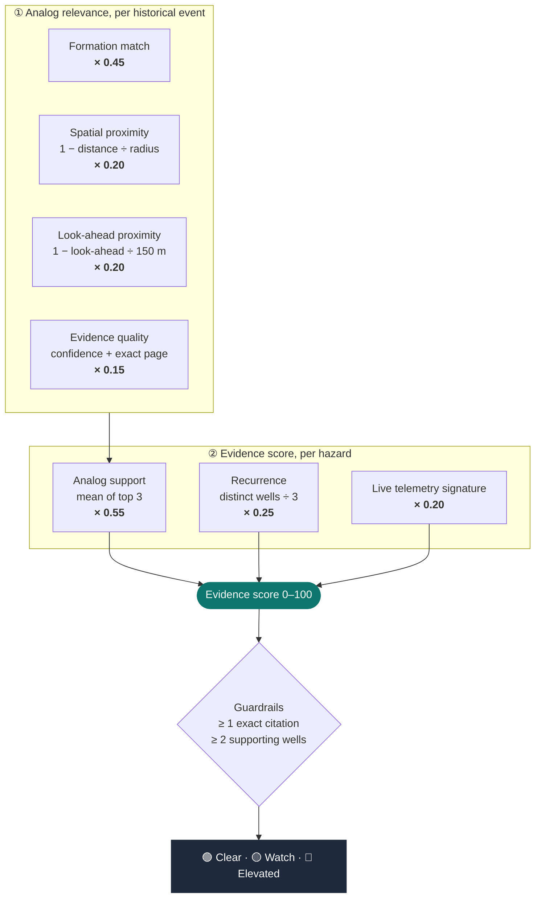
```mermaid
flowchart TB
    subgraph A["① Analog relevance, per historical event"]
        direction LR
        F["Formation match<br/><b>× 0.45</b>"]
        S["Spatial proximity<br/>1 − distance ÷ radius<br/><b>× 0.20</b>"]
        P["Look-ahead proximity<br/>1 − look-ahead ÷ 150 m<br/><b>× 0.20</b>"]
        Q["Evidence quality<br/>confidence + exact page<br/><b>× 0.15</b>"]
    end

    subgraph B["② Evidence score, per hazard"]
        direction LR
        AS["Analog support<br/>mean of top 3<br/><b>× 0.55</b>"]
        RC["Recurrence<br/>distinct wells ÷ 3<br/><b>× 0.25</b>"]
        TL["Live telemetry signature<br/><b>× 0.20</b>"]
    end

    A --> AS
    AS & RC & TL --> SCORE(["Evidence score 0–100"])
    SCORE --> G{"Guardrails<br/>≥ 1 exact citation<br/>≥ 2 supporting wells"}
    G --> STATE["🟢 Clear · 🟡 Watch · 🔴 Elevated"]

    style SCORE fill:#0f766e,color:#fff,stroke:#0f766e
    style STATE fill:#1e293b,color:#fff,stroke:#1e293b
```

**Hazard-specific live telemetry signatures**

| Hazard | Signals NWIS watches for in the live eRTMAC stream |
|:--|:--|
| 🟠 **Mud loss / lost circulation** | Flow-out below flow-in · falling pit-volume trend · standpipe-pressure drop |
| 🔴 **Kick / influx** | Flow-out above flow-in · rising pit-volume trend · gas units above baseline |
| 🟣 **Stuck pipe** | Torque above its rolling baseline · ROP collapse against the recent average · SPP anomaly |

### Alert states

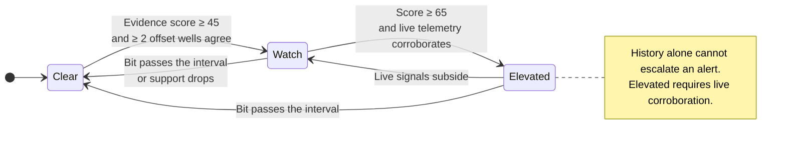
```mermaid
stateDiagram-v2
    direction LR
    [*] --> Clear
    Clear --> Watch: Evidence score ≥ 45<br/>and ≥ 2 offset wells agree
    Watch --> Elevated: Score ≥ 65<br/>and live telemetry corroborates
    Elevated --> Watch: Live signals subside
    Watch --> Clear: Bit passes the interval<br/>or support drops
    Elevated --> Clear: Bit passes the interval

    note right of Elevated
        History alone cannot escalate an alert.
        Elevated requires live corroboration.
    end note
```

> ⚖️ *The evidence score is a relative decision-support signal built from historical similarity, recurrence, evidence quality and live corroboration. It is **not** presented as a calibrated probability, and NWIS never issues autonomous drilling-control instructions.*

---

## 🏗️ System Architecture

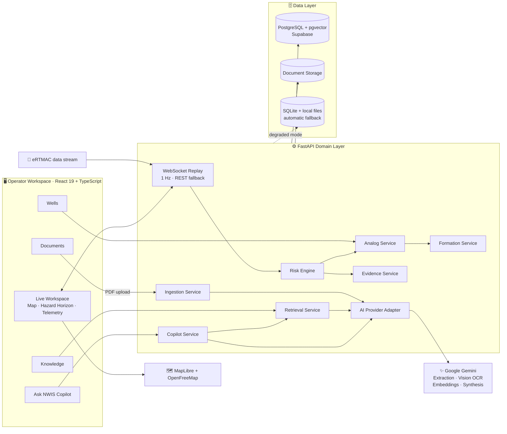
```mermaid
flowchart LR
    subgraph CLIENT["🖥️ Operator Workspace · React 19 + TypeScript"]
        LIVE["Live Workspace<br/>Map · Hazard Horizon · Telemetry"]
        WELLS["Wells"]
        KNOW["Knowledge"]
        DOCS["Documents"]
        ASK["Ask NWIS Copilot"]
    end

    subgraph API["⚙️ FastAPI Domain Layer"]
        direction TB
        WS["WebSocket Replay<br/>1 Hz · REST fallback"]
        FORM["Formation Service"]
        ANALOG["Analog Service"]
        RISK["Risk Engine"]
        INGEST["Ingestion Service"]
        RETR["Retrieval Service"]
        EVID["Evidence Service"]
        COP["Copilot Service"]
        PROV["AI Provider Adapter"]
    end

    subgraph DATA["🗄️ Data Layer"]
        PG[("PostgreSQL + pgvector<br/>Supabase")]
        BLOB[("Document Storage")]
        LITE[("SQLite + local files<br/>automatic fallback")]
    end

    ERTMAC["📡 eRTMAC data stream"]
    GEM["✨ Google Gemini<br/>Extraction · Vision OCR<br/>Embeddings · Synthesis"]
    MAP["🗺️ MapLibre + OpenFreeMap"]

    ERTMAC --> WS
    LIVE <--> WS
    LIVE --> MAP
    WELLS --> ANALOG
    KNOW --> RETR
    DOCS -- PDF upload --> INGEST
    ASK --> COP --> RETR

    WS --> RISK
    RISK --> ANALOG --> FORM
    RISK --> EVID
    INGEST & RETR & COP --> PROV --> GEM

    API --> PG & BLOB
    API -. degraded mode .-> LITE
```

### Document intelligence pipeline

Every uploaded report goes through a staged pipeline whose progress is shown in the UI. Nothing is visible to search or alerts until every stage has passed.

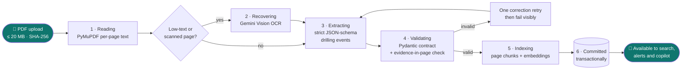
```mermaid
flowchart LR
    U(["📄 PDF upload<br/>≤ 20 MB · SHA-256"]) --> R["1 · Reading<br/>PyMuPDF per-page text"]
    R --> C{"Low-text or<br/>scanned page?"}
    C -- yes --> OCR["2 · Recovering<br/>Gemini Vision OCR"]
    C -- no --> X
    OCR --> X["3 · Extracting<br/>strict JSON-schema<br/>drilling events"]
    X --> V["4 · Validating<br/>Pydantic contract<br/>+ evidence-in-page check"]
    V -- invalid --> RT["One correction retry<br/>then fail visibly"]
    RT --> X
    V -- valid --> I["5 · Indexing<br/>page chunks + embeddings"]
    I --> T[("6 · Committed<br/>transactionally")]
    T --> K(["🧠 Available to search,<br/>alerts and copilot"])

    style U fill:#0f766e,color:#fff
    style K fill:#0f766e,color:#fff
```

**Extraction rules enforced on the model:** extract only explicit evidence; never invent a depth, formation or response; preserve source units; *an empty result is better than a fabricated event.*

### Live alert lifecycle

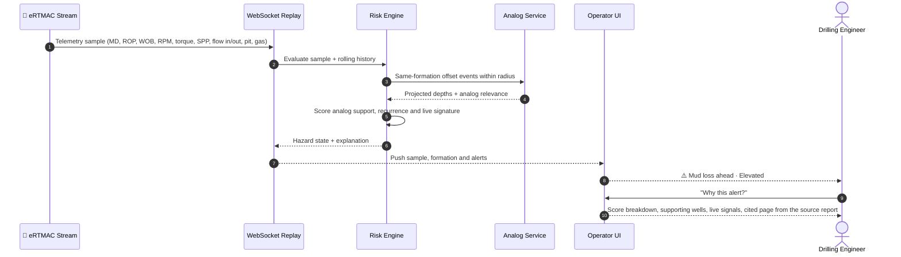
```mermaid
sequenceDiagram
    autonumber
    participant E as 📡 eRTMAC Stream
    participant WS as WebSocket Replay
    participant R as Risk Engine
    participant A as Analog Service
    participant UI as Operator UI
    actor D as Drilling Engineer

    E->>WS: Telemetry sample (MD, ROP, WOB, RPM, torque, SPP, flow in/out, pit, gas)
    WS->>R: Evaluate sample + rolling history
    R->>A: Same-formation offset events within radius
    A-->>R: Projected depths + analog relevance
    R->>R: Score analog support, recurrence and live signature
    R-->>WS: Hazard state + explanation
    WS-->>UI: Push sample, formation and alerts
    UI-->>D: ⚠️ Mud loss ahead · Elevated
    D->>UI: "Why this alert?"
    UI-->>D: Score breakdown, supporting wells, live signals, cited page from the source report
```

### Grounded copilot ("Ask NWIS")

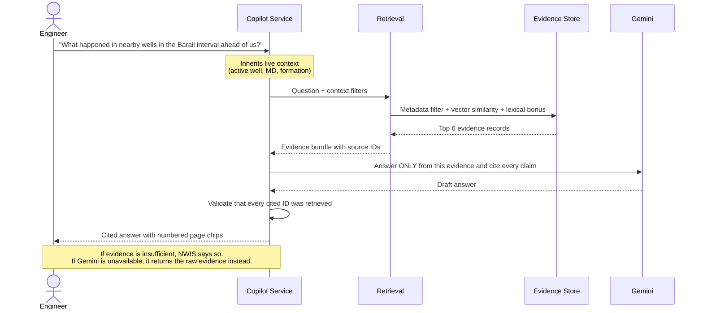
```mermaid
sequenceDiagram
    actor U as Engineer
    participant C as Copilot Service
    participant RT as Retrieval
    participant DB as Evidence Store
    participant G as Gemini

    U->>C: "What happened in nearby wells in the Barail interval ahead of us?"
    Note over C: Inherits live context<br/>(active well, MD, formation)
    C->>RT: Question + context filters
    RT->>DB: Metadata filter + vector similarity + lexical bonus
    DB-->>RT: Top 6 evidence records
    RT-->>C: Evidence bundle with source IDs
    C->>G: Answer ONLY from this evidence and cite every claim
    G-->>C: Draft answer
    C->>C: Validate that every cited ID was retrieved
    C-->>U: Cited answer with numbered page chips
    Note over C,U: If evidence is insufficient, NWIS says so.<br/>If Gemini is unavailable, it returns the raw evidence instead.
```

### Data model

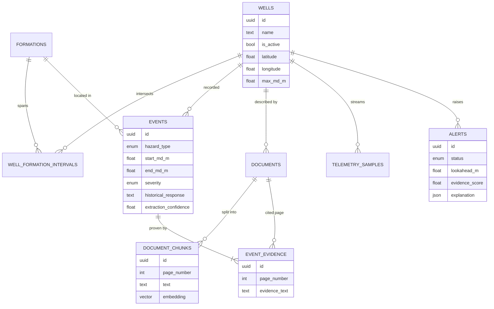
```mermaid
erDiagram
    WELLS ||--o{ WELL_FORMATION_INTERVALS : "intersects"
    FORMATIONS ||--o{ WELL_FORMATION_INTERVALS : "spans"
    WELLS ||--o{ EVENTS : "recorded"
    FORMATIONS ||--o{ EVENTS : "located in"
    WELLS ||--o{ DOCUMENTS : "described by"
    DOCUMENTS ||--o{ DOCUMENT_CHUNKS : "split into"
    EVENTS ||--|{ EVENT_EVIDENCE : "proven by"
    DOCUMENTS ||--o{ EVENT_EVIDENCE : "cited page"
    WELLS ||--o{ TELEMETRY_SAMPLES : "streams"
    WELLS ||--o{ ALERTS : "raises"

    WELLS {
        uuid id
        text name
        bool is_active
        float latitude
        float longitude
        float max_md_m
    }
    EVENTS {
        uuid id
        enum hazard_type
        float start_md_m
        float end_md_m
        enum severity
        text historical_response
        float extraction_confidence
    }
    EVENT_EVIDENCE {
        uuid id
        int page_number
        text evidence_text
    }
    DOCUMENT_CHUNKS {
        uuid id
        int page_number
        text text
        vector embedding
    }
    ALERTS {
        uuid id
        enum status
        float lookahead_m
        float evidence_score
        json explanation
    }
```

---

## 🛡️ Built to Keep Working

A decision-support tool in an operations room cannot fail when one dependency goes down. Every external dependency in NWIS has a visible fallback.

| If this fails… | NWIS does this | The operator sees |
|:--|:--|:--|
| 🤖 Gemini extraction | Keeps the document and page text and creates **no** unvalidated events | `AI extraction unavailable` |
| 💬 Gemini synthesis | Returns the retrieved evidence in a deterministic format | `Generated synthesis unavailable — showing retrieved evidence` |
| 🔌 WebSocket | Switches to 1 Hz REST polling | Replay continues |
| 🗺️ Map tiles | Uses a bundled fallback style with grid, wells and radius | `Basemap unavailable` |
| 🗄️ Supabase / Postgres | Starts from the seeded SQLite and local-file corpus | `LOCAL FALLBACK` badge and `/api/health` reports degraded |
| 📭 No historical analogs | Never fabricates an alert | `No historical analogs in the current look-ahead window` |

---

## 🧰 Tech Stack

<table>
<tr><th>Layer</th><th>Technology</th><th>Why we chose it</th></tr>
<tr><td><b>Frontend</b></td><td>React 19 · TypeScript · Vite · TanStack Query · Recharts · Motion · Lucide</td><td>Fast, type-safe and suited to dense real-time dashboards</td></tr>
<tr><td><b>Mapping</b></td><td>MapLibre GL JS · OpenFreeMap · Survey of India official boundary</td><td>Open-source, no vendor lock-in, and an accurate national map</td></tr>
<tr><td><b>Backend</b></td><td>Python 3.12 · FastAPI · Pydantic v2 · SQLAlchemy 2 · Uvicorn</td><td>Async REST and WebSockets with strict typed contracts</td></tr>
<tr><td><b>Document AI</b></td><td>PyMuPDF · Google Gemini (structured output, vision, embeddings)</td><td>Native text first, with multimodal OCR only where a page needs it</td></tr>
<tr><td><b>Knowledge store</b></td><td>PostgreSQL + pgvector (Supabase) · SQLite + NumPy cosine fallback</td><td>A credible production path with a dependable offline mode</td></tr>
<tr><td><b>Deployment</b></td><td>Vercel (frontend) · Render (API with WebSockets)</td><td>A global CDN for the UI and a long-running server for streaming</td></tr>
</table>

All model calls go through **one provider adapter**, and model IDs are set through environment variables, so swapping to an on-premise or sovereign LLM means changing configuration rather than rewriting services.

---

## 🚀 Quick Start

**Prerequisites:** Python 3.12+, Node.js 20+, npm 10+

```bash
git clone https://github.com/Shrey0604/SIH_2026.git
cd SIH_2026/SIH/SIH

cp .env.example .env            # add GEMINI_API_KEY for live AI features
python3 -m venv .venv
source .venv/bin/activate
make install
make dev
```

| Service | URL |
|:--|:--|
| 🖥️ Operator UI | http://localhost:5173 |
| ⚙️ API | http://localhost:8000 |
| ❤️ Health check | http://localhost:8000/api/health |

The database is created and seeded automatically on first start. `POST /api/demo/reset` returns the replay to its exact starting state.

<details>
<summary><b>⚙️ Configuration reference</b></summary>

```text
# Application
APP_ENV=development
DEMO_MODE=true

# Data backend: sqlite (default) or supabase
DATA_BACKEND=sqlite
DATABASE_URL=sqlite:///./backend/data/nwis.db
# SUPABASE_URL / SUPABASE_SERVICE_ROLE_KEY / SUPABASE_STORAGE_BUCKET (backend only)

# AI (backend only, never exposed to the browser)
GEMINI_API_KEY=
GEMINI_EXTRACTION_MODEL=gemini-3.5-flash
GEMINI_COPILOT_MODEL=gemini-3.5-flash
GEMINI_EMBEDDING_MODEL=gemini-embedding-2
GEMINI_EMBEDDING_DIM=768

# Look-ahead engine
LOOKAHEAD_WINDOW_M=150
WATCH_THRESHOLD=0.45
ELEVATED_THRESHOLD=0.65
```

For hosted PostgreSQL, run the SQL files in `backend/migrations/` in order and set `DATA_BACKEND=supabase`.

</details>

<details>
<summary><b>🧪 Testing and validation</b></summary>

```bash
make check                       # backend unit tests + frontend lint + typecheck
npm --prefix frontend run build  # production build
.venv/bin/python scripts/smoke_demo.py               # end-to-end demo chain
PYTHONPATH=backend .venv/bin/python scripts/verify_gemini.py  # live AI path
```

The 50 backend tests cover formation projection, analog scoring, risk states, ingestion, retrieval, copilot grounding, storage, data fallback and telemetry replay. Gemini is mocked in the normal test suite, so it runs offline.

</details>

<details>
<summary><b>☁️ Cloud deployment</b></summary>

The frontend deploys to **Vercel** and the API to **Render** using the `render.yaml` blueprint at the repo root. See [`SIH/SIH/DEPLOY.md`](SIH/SIH/DEPLOY.md) for the step-by-step guide.

</details>

---

## 🔌 API at a Glance

| Method | Endpoint | Purpose |
|:--|:--|:--|
| `GET` | `/api/health` | API, database, AI and fallback status |
| `GET` | `/api/map/wells` | Map payload: active well, offsets and distances |
| `GET` | `/api/wells/{id}` · `/formations` · `/events` | Well details, formation tops and historical events |
| `GET` | `/api/events?well_id=&formation=&hazard_type=&q=` | Filter the event repository |
| `GET` | `/api/events/{id}/evidence` | Exact source document, page and excerpt |
| `GET` | `/api/knowledge/search` | Search validated events (semantic + lexical) |
| `POST` | `/api/documents/upload` | Ingest a PDF report (returns a job ID) |
| `GET` | `/api/ingestion/{job_id}` | Stage-by-stage ingestion progress |
| `GET` | `/api/documents/{id}/page/{n}` | Render the cited page |
| `WS` | `/api/ws/telemetry/{well_id}` | Live telemetry, formation and alerts (start / pause / resume / reset) |
| `GET` | `/api/telemetry/{well_id}/next` | REST polling fallback |
| `POST` | `/api/copilot/query` | Grounded, cited question answering |
| `POST` | `/api/demo/reset` | Reset replay to its deterministic start |

---

## 🎬 Demo Walkthrough (≈ 4 minutes)

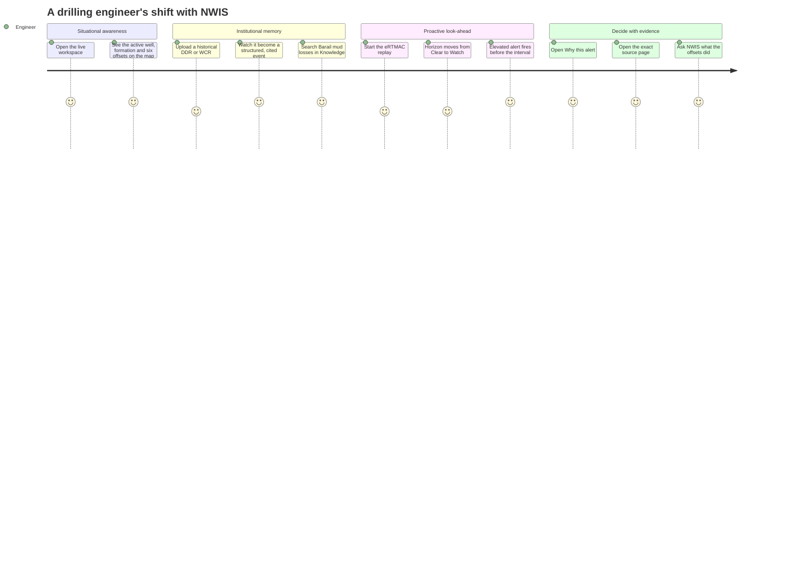
```mermaid
journey
    title A drilling engineer's shift with NWIS
    section Situational awareness
      Open the live workspace: 5: Engineer
      See the active well, formation and six offsets on the map: 5: Engineer
    section Institutional memory
      Upload a historical DDR or WCR: 4: Engineer
      Watch it become a structured, cited event: 5: Engineer
      Search Barail mud losses in Knowledge: 5: Engineer
    section Proactive look-ahead
      Start the eRTMAC replay: 4: Engineer
      Horizon moves from Clear to Watch: 4: Engineer
      Elevated alert fires before the interval: 5: Engineer
    section Decide with evidence
      Open Why this alert: 5: Engineer
      Open the exact source page: 5: Engineer
      Ask NWIS what the offsets did: 5: Engineer
```

1. **Live workspace.** The active well `NWIS-ACT-01` is drilling the **Barail** formation, with six offset wells on the map within a selectable radius.
2. **Documents.** Upload a historical drilling report and watch it pass *Reading → Recovering → Extracting → Validating → Indexing*. The extracted mud-loss event opens on its cited page.
3. **Knowledge.** Filter by *Barail + Mud loss* to see four offset-well incidents, each with its *historical response observed*.
4. **Replay.** Press **Start**. As the bit approaches the projected interval, the Hazard Horizon moves from **Clear** to **Watch**, and then to **Elevated** once live flow imbalance and pit-volume decline corroborate the history.
5. **Why this alert?** Shows the score breakdown, supporting wells, equivalent historical depths, live signals and the source PDF page.
6. **Ask NWIS.** *"What happened in nearby wells in the Barail interval ahead of us?"* returns a concise answer in which every claim is cited.

---

## 📁 Repository Structure

```text
SIH_2026/
├── render.yaml                   # Render blueprint for the API
└── SIH/SIH/
    ├── backend/
    │   ├── app/
    │   │   ├── ai/               # Gemini provider adapter + strict schemas
    │   │   ├── routers/          # wells, events, documents, knowledge, telemetry, copilot
    │   │   ├── services/         # formation, analog, risk, ingestion, retrieval, copilot…
    │   │   ├── repositories/     # PostgreSQL and SQLite implementations of one interface
    │   │   └── storage/          # Supabase and local document storage
    │   ├── migrations/           # pgvector + schema SQL
    │   └── tests/                # 50 unit and integration tests
    ├── frontend/
    │   └── src/components/       # LiveWorkspace, OffsetWellMap, HazardHorizon,
    │                             # TelemetryStrip, EvidenceDrawer, CopilotDrawer…
    ├── demo_data/                # seed corpus, sample DDR/WCR PDFs, telemetry scenarios
    ├── scripts/                  # dev runner, smoke tests, Gemini verifier, map tooling
    └── *.md                      # product, architecture, UI spec and demo documentation
```

---

## 🔐 Responsible AI and Data Integrity

- **No hallucinated events.** Extraction output must pass schema validation and the cited excerpt must be found in the page text before an event is stored.
- **No uncited claims.** The copilot answers only from retrieved evidence, and each source ID it cites is checked against what retrieval returned.
- **No autonomous commands.** Mitigation content is labelled *Historical response observed*. NWIS supports engineering judgement and does not replace it.
- **Explainable scores.** Every alert comes with its full score breakdown. The score is never presented as a probability.
- **Secrets stay server-side.** API and service-role keys are read only by the backend and never reach the browser.
- **Data provenance.** The demonstration corpus is synthetic and deterministic, and is labelled as such in the UI. No Oil India operational data is included in this repository.

---

## 🗺️ Roadmap

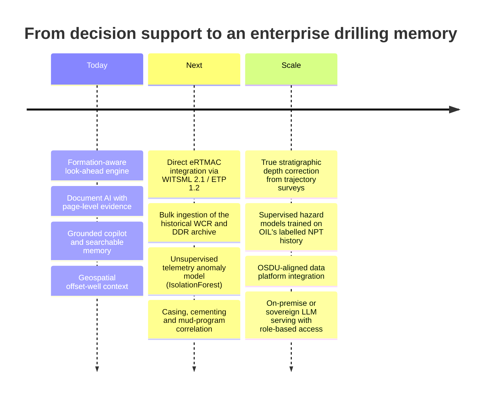
```mermaid
timeline
    title From decision support to an enterprise drilling memory
    Today : Formation-aware look-ahead engine
          : Document AI with page-level evidence
          : Grounded copilot and searchable memory
          : Geospatial offset-well context
    Next : Direct eRTMAC integration via WITSML 2.1 / ETP 1.2
         : Bulk ingestion of the historical WCR and DDR archive
         : Unsupervised telemetry anomaly model (IsolationForest)
         : Casing, cementing and mud-program correlation
    Scale : True stratigraphic depth correction from trajectory surveys
          : Supervised hazard models trained on OIL's labelled NPT history
          : OSDU-aligned data platform integration
          : On-premise or sovereign LLM serving with role-based access
```

| Horizon | Capability | Value to Oil India |
|:--|:--|:--|
| **Next** | Native eRTMAC feed via **WITSML 2.1 / ETP 1.2** | Look-ahead runs directly on the live rig stream |
| **Next** | Bulk archive ingestion | Decades of WCRs and DDRs become searchable in days instead of years |
| **Next** | Casing, cementing and mud-program correlation | Extends risk coverage to well-integrity and cementing issues |
| **Scale** | Supervised models trained on labelled NPT events | Calibrated hazard likelihoods per formation and field |
| **Scale** | Sovereign or on-premise LLM deployment | Operational data never leaves OIL's infrastructure |

---

<div align="center">

### NWIS gives every drilling decision the experience of every well drilled before it.

<br/>

**Built for Smart India Hackathon 2026 · Problem statement by Oil India Limited**

<sub>🇮🇳 Built to benefit the nation of India</sub>

</div>
