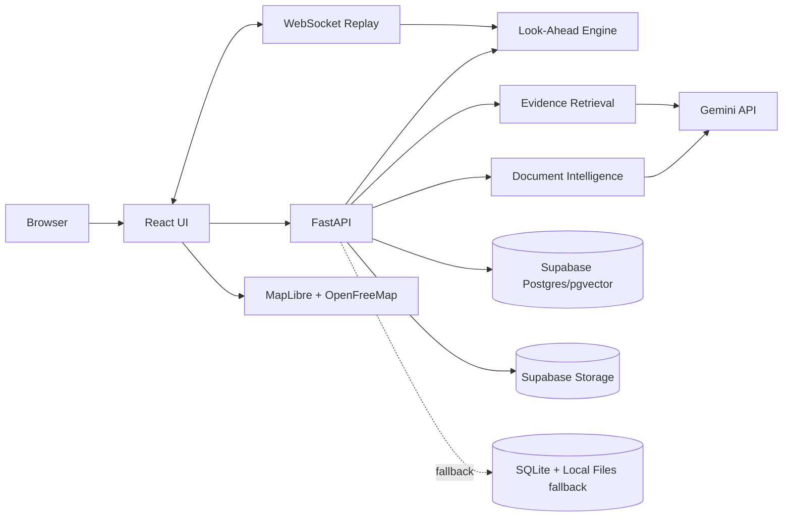

# ARCHITECTURE.md — NWIS Hackathon Architecture

## Architecture philosophy

Build one coherent prototype, not a production platform.

The demo corpus is intentionally small:
- 1 active well
- 5–8 offset wells
- 2–4 formations
- several reports
- hundreds, not millions, of indexed chunks
- three incident classes

The architecture should therefore optimize for:
- low integration risk
- deterministic replay
- explainable logic
- fast debugging
- easy deployment
- an obvious future migration path

Do not add infrastructure because it sounds enterprise-grade.

---

# Stack

## Frontend

- React
- TypeScript
- Vite
- Tailwind CSS
- shadcn/ui primitives used selectively
- MapLibre GL JS
- OpenFreeMap basemap
- Recharts
- Motion
- TanStack Query
- Lucide icons

Avoid a global state library unless local/context state becomes genuinely awkward.

## Backend

- Python 3.12+
- FastAPI
- Pydantic
- SQLAlchemy
- Uvicorn
- PyMuPDF
- Google Gen AI Python SDK
- NumPy
- scikit-learn only if optional P1 anomaly model is implemented

## Recommended hosted data layer

Use Supabase for the hosted demo:

- PostgreSQL
- pgvector
- Supabase Storage

Why:
- persistent database
- SQL visibility during debugging
- Postgres gives a credible production migration path
- pgvector supports embeddings and similarity search
- storage can hold demo reports
- easy to inspect/repair demo data

Important:
- frontend should not contain business logic
- FastAPI remains the application/domain layer
- service-role keys must never be exposed to the browser

## Guaranteed local fallback

The repo must also support:

- SQLite
- local report directory
- embeddings stored as JSON
- NumPy cosine similarity

This is the emergency demo path.

Set:

```text
DATA_BACKEND=supabase
```

or

```text
DATA_BACKEND=sqlite
```

The same domain services should work against both repositories.

---

# Deployment shape

Use a monorepo:

```text
nwis/
├── frontend/
├── backend/
├── demo_data/
├── docs/
├── scripts/
├── Dockerfile
├── .env.example
├── README.md
└── Makefile
```

Recommended final packaging:

1. build React
2. serve built frontend from FastAPI
3. same origin for REST and WebSocket
4. one public URL

Keep the local SQLite fallback runnable with the same Docker image.

---

# High-level architecture



---

# Frontend architecture

## Routes

```text
/               -> redirect /live
/live
/wells
/wells/:wellId
/knowledge
/documents
```

Do not make a landing page.

## App shell

```text
AppShell
├── SideRail
├── TopBar
│   ├── ActiveWellIdentity
│   ├── ReplayControls
│   └── SystemStatus
└── RouteOutlet
```

## Live page

```text
LiveWorkspace
├── LiveContextStrip
├── IntelligenceGrid
│   ├── OffsetWellMap
│   │   ├── RadiusControl
│   │   ├── ActiveWellMarker
│   │   ├── OffsetWellMarkers
│   │   └── WellDrawer
│   └── HazardHorizon
│       ├── FormationTrack
│       ├── CurrentBitMarker
│       ├── LookAheadWindow
│       ├── ProjectedIncidentMarkers
│       └── ActiveHazardCallout
├── TelemetryStrip
│   ├── ROPChart
│   ├── TorqueChart
│   ├── PressureChart
│   └── FlowBalanceChart
├── EvidenceDrawer
└── CopilotDrawer
```

## State

TanStack Query:
- wells
- events
- documents
- alerts
- search results

Streaming context/store:
- latest telemetry sample
- ring buffer, max ~120 samples
- replay state

Local UI state:
- selected well
- selected event
- open drawer
- radius
- map viewport

---

# Backend structure

```text
backend/app/
├── main.py
├── config.py
├── db.py
├── dependencies.py
├── models/
├── schemas/
├── routers/
│   ├── system.py
│   ├── wells.py
│   ├── events.py
│   ├── documents.py
│   ├── telemetry.py
│   ├── alerts.py
│   ├── knowledge.py
│   ├── copilot.py
│   └── demo.py
├── services/
│   ├── formation_service.py
│   ├── analog_service.py
│   ├── risk_service.py
│   ├── telemetry_service.py
│   ├── ingestion_service.py
│   ├── extraction_service.py
│   ├── embedding_service.py
│   ├── retrieval_service.py
│   └── evidence_service.py
├── repositories/
│   ├── base.py
│   ├── postgres/
│   └── sqlite/
└── utils/
    ├── geo.py
    ├── scoring.py
    ├── pdf.py
    └── units.py
```

Keep one FastAPI process.

---

# Data model

## wells

- id: UUID
- name: text
- is_active: boolean
- latitude: double
- longitude: double
- field_name: text
- max_md_m: double
- status: text
- source_kind: `SYNTHETIC | PUBLIC_VOLVE | OIL_FUTURE`

## formations

- id: UUID
- name: text
- code: text unique

## well_formation_intervals

- id: UUID
- well_id: FK
- formation_id: FK
- top_md_m: double
- base_md_m: double
- top_tvd_m: double nullable
- base_tvd_m: double nullable

## documents

- id: UUID
- well_id: FK nullable
- title: text
- document_type: `DDR | WCR | EOWR | OTHER`
- filename: text
- storage_path: text
- page_count: integer
- sha256: text unique
- ingestion_status: text
- source_kind: text
- created_at: timestamp

## document_chunks

- id: UUID
- document_id: FK
- page_number: integer
- chunk_index: integer
- text: text
- embedding: vector/JSON nullable

Hosted Supabase:
- pgvector column sized to the chosen embedding dimensions

SQLite:
- JSON array

## events

- id: UUID
- well_id: FK
- formation_id: FK nullable
- hazard_type: `MUD_LOSS | STUCK_PIPE | KICK`
- start_md_m: double
- end_md_m: double nullable
- severity: `LOW | MEDIUM | HIGH`
- description: text
- historical_response: text nullable
- extraction_confidence: double
- source: `AI_EXTRACTED | SEEDED | REVIEWED`
- created_at: timestamp

## event_evidence

- id: UUID
- event_id: FK
- document_id: FK
- page_number: integer
- evidence_text: text
- bbox_json: JSON nullable

## telemetry_samples

- id
- well_id
- seq
- timestamp_offset_s
- md_m
- tvd_m nullable
- rop_mph
- wob_kn
- rpm
- torque_knm
- spp_bar
- flow_in_lpm
- flow_out_lpm
- pit_volume_m3
- mud_weight_sg
- gas_units

## alerts

- id
- active_well_id
- hazard_type
- status: `WATCH | ELEVATED | CLEARED`
- current_md_m
- projected_hazard_md_m
- lookahead_m
- evidence_score
- analog_support
- recurrence_score
- telemetry_score
- explanation_json
- created_at

---

# Supabase SQL outline

Enable pgvector:

```sql
create extension if not exists vector;
```

Core indexes:

```sql
create index if not exists idx_events_well on events(well_id);
create index if not exists idx_events_formation on events(formation_id);
create index if not exists idx_events_hazard on events(hazard_type);
create index if not exists idx_chunks_document on document_chunks(document_id);
```

For the tiny prototype corpus, do not add an ANN index until there is a reason.

Exact vector dimensionality should come from the configured embedding model.

---

# Formation-aware alignment

Raw measured depths cannot be directly compared across wells.

For the prototype, align incidents using their **normalized position inside the same formation**.

For an offset-well event:

```text
event_mid =
  start_md                         if end_md is null
  (start_md + end_md) / 2         otherwise

relative_position =
  (event_mid - offset_formation_top)
  / (offset_formation_base - offset_formation_top)
```

Clamp to `[0, 1]`.

Project onto the active well:

```text
projected_active_md =
  active_formation_top
  + relative_position
    * (active_formation_base - active_formation_top)
```

Then:

```text
lookahead_m = projected_active_md - current_active_md
```

Candidate if:
- same normalized formation
- `0 < lookahead_m <= LOOKAHEAD_WINDOW_M`

Default:

```text
LOOKAHEAD_WINDOW_M=150
```

Call this:
- formation-relative alignment
- normalized stratigraphic position

Do not call it true stratigraphic-depth correction.

---

# Offset-well analog score

For each same-formation candidate event:

```text
spatial_score =
  max(0, 1 - distance_km / selected_radius_km)

proximity_to_window_score =
  max(0, 1 - lookahead_m / LOOKAHEAD_WINDOW_M)

evidence_quality =
  0.70 * extraction_confidence
  + 0.30 * has_exact_page_evidence
```

Then:

```text
analog_relevance =
  0.45 * formation_match
  + 0.20 * spatial_score
  + 0.20 * proximity_to_window_score
  + 0.15 * evidence_quality
```

`formation_match` is 1 because cross-formation candidates are excluded.

Clamp to `[0,1]`.

This is an interpretable relevance score, not a probability.

---

# Live telemetry corroboration

Use deterministic, hazard-specific signals.

## Mud loss

Signals:
- flow out below flow in
- pit volume falling
- optional standpipe-pressure deviation

## Kick / influx

Signals:
- flow out above flow in
- pit volume rising
- gas units rising
- optional ROP increase

## Stuck pipe

Signals:
- torque above rolling baseline
- ROP collapsing
- WOB/pressure anomaly

Normalize each signal to `[0,1]`.

Use configuration values so the scripted telemetry can be tuned reliably.

---

# Evidence score

Group candidate events by hazard.

Take up to the top three analog events.

```text
analog_support = mean(top_analogs.relevance)

recurrence_score =
  min(1, distinct_supporting_wells / 3)

telemetry_score =
  hazard_specific_live_score

evidence_score =
  0.55 * analog_support
  + 0.25 * recurrence_score
  + 0.20 * telemetry_score
```

Display as 0–100.

Suggested states:

```text
0–44   Clear
45–64  Watch
65–100 Elevated
```

Guardrails:
- at least one exact citation
- normally require two supporting wells
- one high-severity event may qualify only if evidence quality is high

UI disclaimer:

> Evidence score is a relative decision-support signal, not a calibrated probability.

---

# Optional P1 ML layer

If all P0 work is stable, add a deterministic IsolationForest:

Training:
- use only the seeded `normal_telemetry.csv`
- fixed `random_state=42`
- feature vector:
  - flow imbalance
  - pit-volume slope
  - torque z-score
  - pressure z-score
  - ROP ratio
  - gas z-score

Output:
- anomaly score only

Use it as one auxiliary telemetry-corrobation feature.

Never call it a hazard probability.

---

# Document ingestion pipeline

## 1. Validate

P0:
- PDF only
- maximum 20 MB
- reject encrypted/unreadable files with useful error
- SHA-256 file hash

## 2. Read per page

First use PyMuPDF.

For every page:
- preserve page number
- preserve raw text
- record text quality

## 3. OCR/vision fallback

If the page has very little usable text:
- render the page to PNG
- send the image to the configured multimodal Gemini model
- ask for faithful text recovery and event extraction
- keep the original page number

This avoids making Tesseract a hard runtime dependency.

Tesseract can be a P1 local/offline fallback.

## 4. Structured extraction

Use Gemini structured JSON output with a strict JSON schema and Pydantic validation.

Target schema:

```json
{
  "events": [
    {
      "hazard_type": "MUD_LOSS | STUCK_PIPE | KICK",
      "formation": "string | null",
      "start_md_m": 0,
      "end_md_m": null,
      "severity": "LOW | MEDIUM | HIGH",
      "description": "string",
      "historical_response": "string | null",
      "page_number": 1,
      "evidence_text": "short source-supported excerpt",
      "confidence": 0.0
    }
  ]
}
```

Extraction prompt rules:
- extract only explicit evidence
- never invent depth
- never invent formation
- never invent response
- preserve source units
- one event may reference multiple evidence spans if necessary
- no event is better than a hallucinated event

## 5. Validate

Backend validation:
- known enum
- valid page
- positive depth
- start/end order valid
- cited evidence approximately exists in page text when text-native
- confidence in `[0,1]`

If invalid:
- one model retry with validation errors
- then mark extraction failed

## 6. Chunk and embed

Chunk by page.

Target:
- 800–1,500 characters
- small overlap
- never lose document/page metadata

Create embeddings using the environment-configured Gemini embeddings model. Store the
provider, model, and dimension with every vector; never compare vectors from different
embedding spaces. Format document and query inputs centrally in `EmbeddingService`.

## 7. Persist transactionally

Store:
- document
- chunks
- events
- evidence links

No half-indexed event should become visible.

---

# AI/API integration

## Model configuration

Never hardcode model IDs throughout the code.

Example:

```text
GEMINI_EXTRACTION_MODEL=gemini-3.5-flash
GEMINI_COPILOT_MODEL=gemini-3.5-flash
GEMINI_EMBEDDING_MODEL=gemini-embedding-2
GEMINI_EMBEDDING_DIM=768
```

All calls should go through one adapter.

If a model is unavailable, replace it through environment configuration.

## AI is used for

P0:
- structured report-event extraction
- scanned-page recovery/vision OCR when required
- query embedding
- grounded copilot synthesis

AI is not used for:
- live alert threshold logic
- formation projection math
- distance calculation
- evidence score arithmetic

That separation improves explainability.

---

# Retrieval / RAG

P0 hosted path:

1. metadata filter where available
2. vector similarity
3. small lexical bonus
4. return top 6 chunks/events

Filters can include:
- formation
- well
- hazard type

For the bounded corpus, prioritize correctness over ANN tuning.

Copilot receives:
- user question
- current live context
- top evidence
- source IDs

Copilot system constraints:
- answer only from supplied evidence
- distinguish facts from inference
- cite material claims
- describe recorded mitigation as `Historical response observed`
- do not issue autonomous drilling-control commands
- if evidence is insufficient, say so

---

# API endpoints

## System

### GET `/api/health`

Returns:
- API status
- database status
- Gemini configured yes/no
- effective and configured data backend
- visible local-fallback reason, when active
- demo mode

### POST `/api/demo/reset`

Resets:
- replay sequence
- runtime alerts
- transient demo state

Idempotent.

---

## Wells

### GET `/api/wells?active_well_id=&radius_km=`

Returns:
- wells
- distance
- relevant event counts
- analog summary

### GET `/api/wells/{well_id}`

### GET `/api/wells/{well_id}/formations`

### GET `/api/wells/{well_id}/events`

---

## Events / knowledge

### GET `/api/events`

Filters:
- well_id
- formation
- hazard_type
- q

### GET `/api/events/{event_id}`

### GET `/api/events/{event_id}/evidence`

---

## Documents

### POST `/api/documents/upload`

Multipart:
- file
- optional well_id
- optional document_type

Returns:
- document_id
- ingestion_job_id
- status

### GET `/api/ingestion/{job_id}`

States:
- queued
- reading
- recovering_scan
- extracting
- validating
- indexing
- completed
- failed

### GET `/api/documents/{document_id}`

### GET `/api/documents/{document_id}/page/{page_number}`

Return a page image or renderable page artifact.

---

## Telemetry

### WS `/api/ws/telemetry/{well_id}`

Server payload:

```json
{
  "type": "telemetry",
  "sample": {},
  "active_formation": {},
  "alerts": []
}
```

Client control payload:

```json
{"action":"start"}
{"action":"pause"}
{"action":"resume"}
{"action":"reset"}
```

### GET `/api/telemetry/{well_id}/next?seq=`

REST fallback.

---

## Alerts

### GET `/api/alerts/current?well_id=`

### GET `/api/alerts/{alert_id}`

### GET `/api/alerts/{alert_id}/explanation`

Include:
- score breakdown
- analog events
- live signals
- evidence references

---

## Copilot

### POST `/api/copilot/query`

Request:

```json
{
  "question": "What happened in nearby wells in the Barail interval ahead of us?",
  "active_well_id": "...",
  "current_md_m": 3290,
  "formation": "Barail",
  "selected_well_ids": []
}
```

### GET `/api/knowledge/search`

Accepts optional `q`, `well_id`, `formation`, and `hazard_type` filters. Results are validated historical events only; records without exact stored evidence are excluded.

Copilot orchestration always retrieves before generation. It combines structured metadata and lexical overlap with Gemini query-vector similarity when available, returns no more than six evidence records, and validates that every returned source ID was supplied by retrieval and cited inline. A provider failure never removes the raw evidence bundle.

Response:

```json
{
  "answer_markdown": "...",
  "sources": [
    {
      "document_id": "...",
      "title": "...",
      "page_number": 2,
      "well_name": "...",
      "event_id": "..."
    }
  ],
  "insufficient_evidence": false
}
```

---

# Major services

## TelemetryReplayService
- loads deterministic CSV
- current sequence
- start/pause/resume/reset
- one sample/sec

## FormationService
- maps active MD to formation
- normalized position

## AnalogService
- same-formation event retrieval
- formation-relative projection
- distance
- relevance score

## RiskService
- live feature scoring
- recurrence
- evidence score
- state transitions
- alert explanation

## IngestionService
- validation
- page extraction
- OCR/vision fallback
- structured extraction
- persistence

## RetrievalService
- metadata filtering
- embedding similarity
- evidence bundle

## EvidenceService
- event/document/page relationship
- source navigation payload

---

# Error/fallback behavior

## AI extraction unavailable

- keep uploaded document
- preserve page text
- show `AI extraction unavailable`
- do not create unvalidated events

For the known demo document only:
- a cached verified extraction may be loaded when `DEMO_MODE=true`
- clearly label it `cached verified extraction`

## Copilot unavailable

Return deterministic evidence results:

- event
- well
- formation
- depth
- historical response observed
- source page

Label:

> Generated synthesis unavailable — showing retrieved evidence.

## Scanned-page recovery unavailable

- text-native documents still ingest
- scanned page gets explicit failure state
- main demo report must be text-native unless scanned-page recovery has been rehearsed

## Map tiles unavailable

Use bundled fallback MapLibre style:
- neutral background
- grid
- well markers
- radius circle

Show:
`Basemap unavailable`

The core well geometry must remain usable.

## WebSocket unavailable

Switch to REST polling at 1 Hz.

## Source viewer fails

Show:
- rendered cited page image if available
- evidence excerpt
- page number

## Supabase unavailable

In demo mode, backend startup catches an unavailable configured Supabase database or storage layer and initializes the deterministic SQLite/local-file corpus instead. Health reports `status=degraded`, `configured_data_backend=supabase`, `data_backend=sqlite`, and a non-secret fallback reason; the frontend shows `LOCAL FALLBACK`. Outside demo mode, configuration/startup errors remain fatal instead of being hidden.

## No historical evidence

Show:

`No historical analogs in the current look-ahead window.`

Never fabricate an alert.

---

# Third-party integrations

## Gemini API

Used for:
- structured extraction
- vision/OCR fallback
- embeddings
- grounded answer synthesis

Use an API project key stored only in backend environment variables.

All SDK access is isolated in `GeminiAIProvider`, which implements extraction,
low-text-page recovery, embedding generation, and grounded answer generation. Domain
services depend on the provider interface rather than the SDK.

Gemini receives a structural JSON-schema subset derived from the strict Pydantic
models; every response is then validated against the complete Pydantic contract.
Transient 429/5xx provider responses receive three bounded attempts. A malformed or
evidence-invalid extraction receives one model correction retry before failing.

## Supabase

Recommended hosted:
- Postgres
- pgvector
- report storage

Do not make the frontend dependent on direct Supabase queries for domain-critical behavior.

## MapLibre GL JS + OpenFreeMap

Used for:
- interactive map
- markers
- radius visualization

MapLibre is open-source.
OpenFreeMap provides a compatible public style endpoint.

## Future WITSML / ETP

Do not build for the hackathon.

Production note:
- WITSML is the industry standard for drilling/completions/intervention data exchange
- current WITSML 2.1 implementations use ETP 1.2

Keep the internal telemetry DTO neutral so a future WITSML adapter can map into it.

---

# Important implementation decisions

1. The Look-Ahead Hazard Horizon is the differentiator.
2. Evidence is a first-class entity, not a citation added later.
3. Formation-relative alignment beats naïve same-depth comparison.
4. The score is explainable and explicitly non-probabilistic.
5. AI handles unstructured information; deterministic code handles safety-relevant alert arithmetic.
6. Supabase is preferred for the hosted demo, but SQLite must remain a one-command fallback.
7. Do not make OCR, map tiles, WebSockets, or AI availability single points of failure.
8. Do not use Kafka, Redis, Celery, microservices, Neo4j, or LangChain in P0.
9. No auth in P0.
10. No autonomous drilling instructions.
11. All demo values are deterministic.
12. One reset button restores the known judging state.

---

# Environment variables

```text
APP_ENV=development
DEMO_MODE=true

DATA_BACKEND=supabase
DATABASE_URL=
SUPABASE_URL=
SUPABASE_SERVICE_ROLE_KEY=
SUPABASE_STORAGE_BUCKET=nwis-documents

GEMINI_API_KEY=
GEMINI_EXTRACTION_MODEL=gemini-3.5-flash
GEMINI_COPILOT_MODEL=gemini-3.5-flash
GEMINI_EMBEDDING_MODEL=gemini-embedding-2
GEMINI_EMBEDDING_DIM=768

LOOKAHEAD_WINDOW_M=150
WATCH_THRESHOLD=0.45
ELEVATED_THRESHOLD=0.65

OPENFREEMAP_STYLE_URL=https://tiles.openfreemap.org/styles/liberty
```

Never commit keys.
